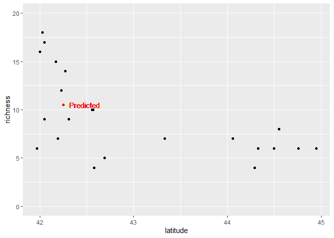
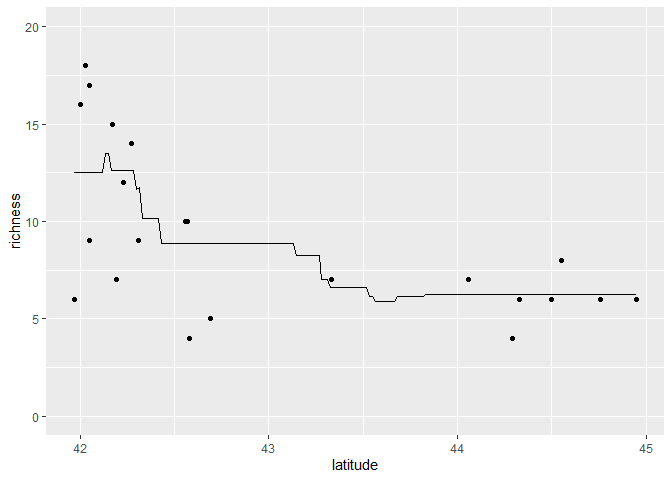
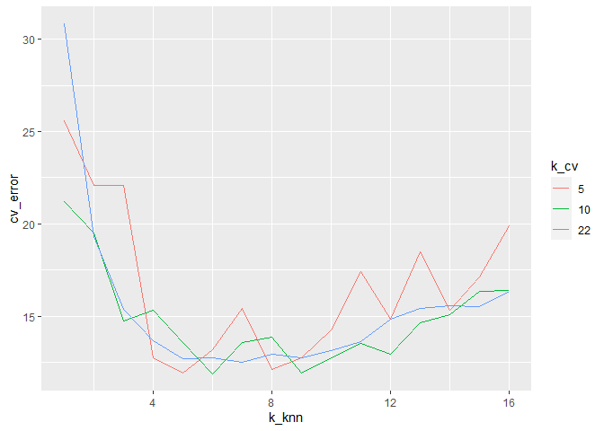
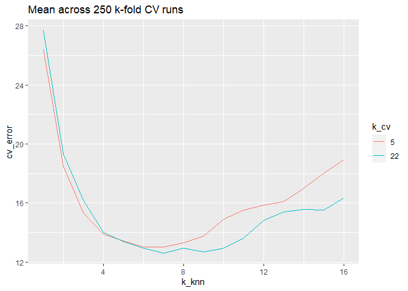

Ant data: k nearest neighbors model algorithm
================
Brett Melbourne
21 Jan 2022

KNN for the regression case illustrated with the ants data. This code is
much the same as `ants_cv.R` but instead of using a smoothing spline as
the model algorithm we use KNN.

``` r
library(ggplot2)
library(dplyr)
library(tidyr)
```

Forest ant data:

``` r
forest_ants <- read.csv("data/ants.csv") %>% 
    filter(habitat=="forest")
```

K Nearest Neighbors (KNN) algorithm for 1 new value of x, translating
our pseudocode to R code.

``` r
# Set k = number of nearest neighbors
k <- 4

# Input (x, y) = x, y data pairs
x <- forest_ants$latitude
y <- forest_ants$richness

# Input x_new = x value at which to predict y_new
x_new <- 42.25

# Calculate d = distance of x_new to other x 
d <- abs(x - x_new)
 
# Sort y data ascending by d; break ties randomly
y_sort <- y[order(d, sample(1:length(d)))]

# Predict new y = mean of k nearest y data
y_pred <- mean(y_sort[1:k])
```

The predicted value for richness of 10.5 makes sense.

``` r
y_pred
```

    ## [1] 10.5

``` r
forest_ants %>% 
    ggplot() +
    geom_point(aes(x=latitude, y=richness)) +
    geom_point(aes(x=x_new, y=y_pred), col="red") +
    geom_text(aes(x=x_new, y=y_pred, label="Predicted"), col="Red", hjust=-0.2) +
    coord_cartesian(ylim=c(0,20))
```

<!-- -->

Now as a function that can accept a vector of new x values and return a
vector of predictions.

``` r
# KNN function for a vector of x_new
# x:       x data (vector, numeric)
# y:       y data (vector, numeric)
# x_new:   x values at which to predict y (vector, numeric)
# k:       number of nearest neighbors to average (scalar, integer)
# return:  predicted y at x_new (vector, numeric)
#
knn <- function(x, y, x_new, k) {
    y_pred <- NA * x_new
    for ( i in 1:length(x_new) ) {
    #   Distance of x_new to other x
        d <- abs(x - x_new[i])
    #   Sort y ascending by d; break ties randomly
        y_sort <- y[order(d, sample(1:length(d)))]
    #   Mean of k nearest y data
        y_pred[i] <- mean(y_sort[1:k])
    }
    return(y_pred)
}
```

Test the output of the knn function.

``` r
knn(forest_ants$latitude, forest_ants$richness, x_new=42:45, k=4)
```

    ## [1] 14.25  6.50  5.75  6.50

Plot. Use this block of code to try different values of k
(i.e. different numbers of nearest neighbors).

``` r
grid_latitude  <- seq(min(forest_ants$latitude), max(forest_ants$latitude), length.out=201)
pred_richness <- knn(forest_ants$latitude, forest_ants$richness, x_new=grid_latitude, k=8)
preds <- data.frame(grid_latitude, pred_richness)

forest_ants %>% 
    ggplot() +
    geom_point(aes(x=latitude, y=richness)) +
    geom_line(data=preds, aes(x=grid_latitude, y=pred_richness)) +
    coord_cartesian(ylim=c(0,20))
```

<!-- -->

k-fold CV for KNN. Be careful not to confuse the k’s!

``` r
# Function to partition a data set into random folds for cross-validation
# n:       length of dataset (scalar, integer)
# k:       number of folds (scalar, integer)
# return:  fold labels (vector, integer)
# 
random_folds <- function(n, k) {
    min_n <- floor(n / k)
    extras <- n - k * min_n
    labels <- c(rep(1:k, each=min_n),rep(seq_len(extras)))
    folds <- sample(labels, n)
    return(folds)
}

# Function to perform k-fold CV for the KNN model algorithm on ants data
# k_cv:    number of folds (scalar, integer)
# k_knn:   number of nearest neighbors to average (scalar, integer)
# return:  CV error as RMSE (scalar, numeric)
#
cv_ants <- function(k_cv, k_knn) {
    forest_ants$fold <- random_folds(nrow(forest_ants), k_cv)
    e <- rep(NA, k_cv)
    for ( i in 1:k_cv ) {
        test_data <- forest_ants %>% filter(fold == i)
        train_data <- forest_ants %>% filter(fold != i)
        pred_richness <- knn(train_data$latitude, 
                             train_data$richness, 
                             x_new=test_data$latitude, 
                             k=k_knn)
        e[i] <- mean((test_data$richness - pred_richness) ^ 2)
    }
    cv_error <- mean(e)
    return(cv_error)
}
```

Test the function

``` r
cv_ants(k_cv=10, k_knn=8)
```

    ## [1] 12.60286

``` r
cv_ants(k=nrow(forest_ants), k_knn=7) #LOOCV
```

    ## [1] 12.75046

Explore a grid of values for k\_cv and k\_knn

``` r
grid <- expand.grid(k_cv=c(5,10,nrow(forest_ants)), k_knn=1:16)
grid
```

    ##    k_cv k_knn
    ## 1     5     1
    ## 2    10     1
    ## 3    22     1
    ## 4     5     2
    ## 5    10     2
    ## 6    22     2
    ## 7     5     3
    ## 8    10     3
    ## 9    22     3
    ## 10    5     4
    ## 11   10     4
    ## 12   22     4
    ## 13    5     5
    ## 14   10     5
    ## 15   22     5
    ## 16    5     6
    ## 17   10     6
    ## 18   22     6
    ## 19    5     7
    ## 20   10     7
    ## 21   22     7
    ## 22    5     8
    ## 23   10     8
    ## 24   22     8
    ## 25    5     9
    ## 26   10     9
    ## 27   22     9
    ## 28    5    10
    ## 29   10    10
    ## 30   22    10
    ## 31    5    11
    ## 32   10    11
    ## 33   22    11
    ## 34    5    12
    ## 35   10    12
    ## 36   22    12
    ## 37    5    13
    ## 38   10    13
    ## 39   22    13
    ## 40    5    14
    ## 41   10    14
    ## 42   22    14
    ## 43    5    15
    ## 44   10    15
    ## 45   22    15
    ## 46    5    16
    ## 47   10    16
    ## 48   22    16

``` r
cv_error <- rep(NA, nrow(grid))
set.seed(6363) #For reproducible results in this text
for ( i in 1:nrow(grid) ) {
    cv_error[i] <- cv_ants(grid$k_cv[i], grid$k_knn[i])
}
result1 <- cbind(grid,cv_error)
```

Plot the result.

``` r
result1 %>% 
    ggplot() +
    geom_line(aes(x=k_knn, y=cv_error, col=factor(k_cv))) +
    labs(col="k_cv")
```

<!-- -->

LOOCV (k\_cv = 22) identifies the KNN model with k\_knn = 7 nearest
neighbors as having the best predictive performance. We see again that
there is a lot of variance in 5-fold and 10-fold CV and so we would not
want to trust a single run of k-fold CV. For the KNN model, we probably
don’t want to trust a single run of LOOCV either, since there is a
random component to breaking ties in the KNN model. Let’s look at 5-fold
CV and LOOCV with many replicate CV runs with random folds.

``` r
grid <- expand.grid(k_cv=c(5,22), k_knn=1:16)
grid

reps <- 250
cv_error <- matrix(NA, nrow=nrow(grid), ncol=reps)
set.seed(7419) #For reproducible results in this text
for ( j in 1:reps ) {
    for ( i in 1:nrow(grid) ) {
        cv_error[i,j] <- cv_ants(grid$k_cv[i], grid$k_knn[i])
    }
    print(j) #monitor
}
result2 <- cbind(grid,cv_error)
result2$mean_cv <- rowMeans(result2[,-(1:2)])
```

Plot the result.

``` r
result2 %>%
    select(k_cv, k_knn, mean_cv) %>%
    rename(cv_error=mean_cv) %>%
    ggplot() +
    geom_line(aes(x=k_knn, y=cv_error, col=factor(k_cv))) +
    labs(title=paste("Mean across",reps,"k-fold CV runs"), col="k_cv")
```

<!-- -->

and print out to see the detailed numbers

``` r
result2 %>% 
    arrange(k_cv) %>% 
    select(k_cv, k_knn, mean_cv)
```

    ##    k_cv k_knn  mean_cv
    ## 1     5     1 26.41756
    ## 2     5     2 18.48430
    ## 3     5     3 15.31755
    ## 4     5     4 13.90081
    ## 5     5     5 13.41545
    ## 6     5     6 13.01379
    ## 7     5     7 13.02613
    ## 8     5     8 13.32905
    ## 9     5     9 13.75747
    ## 10    5    10 14.89716
    ## 11    5    11 15.52593
    ## 12    5    12 15.85196
    ## 13    5    13 16.09378
    ## 14    5    14 17.02255
    ## 15    5    15 18.02458
    ## 16    5    16 18.93897
    ## 17   22     1 27.65818
    ## 18   22     2 19.29545
    ## 19   22     3 16.17879
    ## 20   22     4 13.98970
    ## 21   22     5 13.40444
    ## 22   22     6 12.94657
    ## 23   22     7 12.62650
    ## 24   22     8 12.94886
    ## 25   22     9 12.69278
    ## 26   22    10 12.94079
    ## 27   22    11 13.62847
    ## 28   22    12 14.81282
    ## 29   22    13 15.40425
    ## 30   22    14 15.54777
    ## 31   22    15 15.53584
    ## 32   22    16 16.33452

We see (in both plot and table) that 5-fold CV identifies k\_knn = 6
nearest neighbors as having the best predictive performance but k\_knn =
7 has essentially the same performance. LOOCV averaged over multiple
runs still picks k\_knn = 7. Had we relied on a single run of LOOCV
here, which identified k\_knn = 7, we would still have made a good
choice for k\_knn since the models have similar performance.

What about the KNN model versus the smoothing-spline model? Which has
the best predictive performance? Collating the results from our CV
inference algorithms, we have the following estimated RMSEs:

| Model              | LOOCV | 5-fold CV |
|--------------------|-------|-----------|
| KNN 6              | 12.95 | 13.01     |
| KNN 7              | 12.63 | 13.03     |
| Smoothing spline 3 | 12.52 | 12.77     |

We see that both LOOCV and 5-fold CV give the edge to the smoothing
spline model. Nevertheless, for these data any of these three models has
about the same predictive performance. It is worth noting that a single
run of LOOCV would have picked KNN 7 as the best model with LOOCV =
12.48; this illustrates that one should be wary wherever randomness is
involved, whether in the model, training, or inference algorithm.
