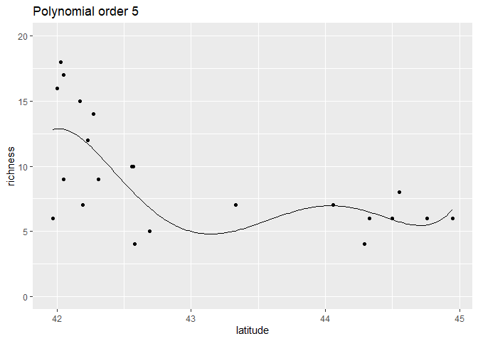
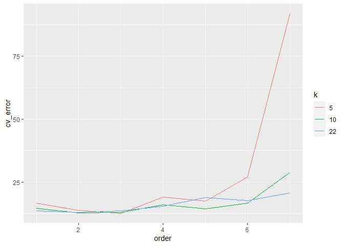
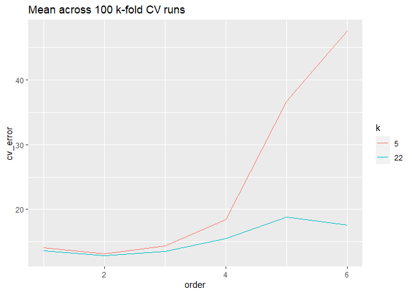

Ant data: Machine learning with polynomial model algorithm
================
Brett Melbourne
24 Jan 2022

Polynomial model illustrated with the ants data. This code is much the
same as `ants_cv.R` but instead of using a smoothing spline as the model
algorithm we use a polynomial.

``` r
library(ggplot2)
library(dplyr)
```

Forest ant data:

``` r
forest_ants <- read.csv("data/ants.csv") %>% 
    filter(habitat=="forest")
```

Here is one way we could code a 3rd order polynomial using R’s model
formula syntax. The `I()` function ensures that `^` is not interpreted
as model formula syntax. See `?formula` for more details.

``` r
lm(richness ~ latitude + I(latitude^2) + I(latitude^3), data=forest_ants)
```

    ## 
    ## Call:
    ## lm(formula = richness ~ latitude + I(latitude^2) + I(latitude^3), 
    ##     data = forest_ants)
    ## 
    ## Coefficients:
    ##   (Intercept)       latitude  I(latitude^2)  I(latitude^3)  
    ##    84336.3595     -5736.2100       130.0406        -0.9825

Briefly, model formulae provide a shorthand notation for (mostly) linear
models, e.g. `y ~ x1 + x2` is shorthand for the model:

y = beta\_0 + beta\_1 \* x1 + beta\_2 \* x2

A more convenient way is the function `poly()`

``` r
lm(richness ~ poly(latitude, degree=3), data=forest_ants)
```

    ## 
    ## Call:
    ## lm(formula = richness ~ poly(latitude, degree = 3), data = forest_ants)
    ## 
    ## Coefficients:
    ##                 (Intercept)  poly(latitude, degree = 3)1  
    ##                       9.182                      -11.604  
    ## poly(latitude, degree = 3)2  poly(latitude, degree = 3)3  
    ##                       6.170                       -2.629

The difference in the parameter estimates from the previous approach is
because the parameterization is different. Use the argument `raw=TRUE`
for the same parameterization (see `?poly`). In machine learning we
don’t care about the parameter values, just the resulting prediction,
which is exactly the same for the two approaches.

Plot. Use this block of code to try different values for the order (syn.
degree) of the polynomial.

``` r
order <- 5 #integer
poly_trained <- lm(richness ~ poly(latitude, order), data=forest_ants)
grid_latitude  <- seq(min(forest_ants$latitude), max(forest_ants$latitude), length.out=201)
nd <- data.frame(latitude=grid_latitude)
pred_richness <- predict(poly_trained, newdata=nd)
preds <- cbind(nd,richness=pred_richness)

forest_ants %>% 
    ggplot() +
    geom_point(aes(x=latitude, y=richness)) +
    geom_line(data=preds, aes(x=latitude, y=richness)) +
    coord_cartesian(ylim=c(0,20)) +
    labs(title=paste("Polynomial order", order))
```

<!-- -->

Inference algorithm: k-fold CV

``` r
# Function to partition a data set into random folds for cross-validation
# n:       length of dataset (scalar, integer)
# k:       number of folds (scalar, integer)
# return:  fold labels (vector, integer)
# 
random_folds <- function(n, k) {
    min_n <- floor(n / k)
    extras <- n - k * min_n
    labels <- c(rep(1:k, each=min_n),rep(seq_len(extras)))
    folds <- sample(labels, n)
    return(folds)
}

# Function to perform k-fold CV for the polynomial model algorithm on ants data
# k_cv:    number of folds (scalar, integer)
# order:   order of the polynomial (scalar, integer)
# return:  CV error as RMSE (scalar, numeric)
#
cv_ants <- function(k, order) {
    forest_ants$fold <- random_folds(nrow(forest_ants), k)
    e <- rep(NA, k)
    for ( i in 1:k ) {
        test_data <- forest_ants %>% filter(fold == i)
        train_data <- forest_ants %>% filter(fold != i)
        poly_trained <- lm(richness ~ poly(latitude, order), data=train_data)
        pred_richness <- predict(poly_trained, newdata=test_data)
        e[i] <- mean((test_data$richness - pred_richness) ^ 2)
    }
    cv_error <- mean(e)
    return(cv_error)
}
```

Test the function

``` r
cv_ants(k=10, order=4)
```

    ## [1] 15.3008

``` r
cv_ants(k=nrow(forest_ants), order=4) #LOOCV
```

    ## [1] 15.51312

Explore a grid of values for k and order

``` r
grid <- expand.grid(k=c(5,10,nrow(forest_ants)), order=1:7)
cv_error <- rep(NA, nrow(grid))
set.seed(7116) #For reproducible results in this text
for ( i in 1:nrow(grid) ) {
    cv_error[i] <- cv_ants(grid$k[i], grid$order[i])
}
result1 <- cbind(grid,cv_error)
```

Plot the result.

``` r
result1 %>% 
    ggplot() +
    geom_line(aes(x=order, y=cv_error, col=factor(k))) +
    labs(col="k")
```

<!-- -->

As for previous models we see we can’t rely on a single 5-fold or
10-fold run, so we’ll do repeated random folds and average them. It
should suffice to do 5-fold up to order 6, and we don’t need to do LOOCV
repeatedly since it is deterministic for this model.

``` r
grid <- expand.grid(k=5, order=1:6)
reps <- 100
cv_error <- matrix(NA, nrow=nrow(grid), ncol=reps)
set.seed(8216) #For reproducible results in this text
for ( j in 1:reps ) {
    for ( i in 1:nrow(grid) ) {
        cv_error[i,j] <- cv_ants(grid$k[i], grid$order[i])
    }
    print(j) #monitor
}
result2 <- cbind(grid,cv_error)
result2$mean_cv <- rowMeans(result2[,-(1:2)])
```

Plot the result.

``` r
loocv <- result1 %>% 
    filter(k == 22, order <= 6)

result2 %>%
    select(k, order, mean_cv) %>%
    rename(cv_error=mean_cv) %>%
    rbind(., loocv) %>%
    ggplot() +
    geom_line(aes(x=order, y=cv_error, col=factor(k))) +
    labs(title=paste("Mean across", reps, "k-fold CV runs"), col="k")
```

<!-- -->

``` r
result2 %>% 
    select(k, order, mean_cv) %>% 
    rename(cv_error=mean_cv) %>%
    rbind(., loocv) %>%
    arrange(k)
```

    ##     k order cv_error
    ## 1   5     1 14.06217
    ## 2   5     2 13.09708
    ## 3   5     3 14.35321
    ## 4   5     4 18.41976
    ## 5   5     5 36.72723
    ## 6   5     6 47.55684
    ## 7  22     1 13.63068
    ## 8  22     2 12.87801
    ## 9  22     3 13.54701
    ## 10 22     4 15.51312
    ## 11 22     5 18.82428
    ## 12 22     6 17.59199

We see that order = 2 has the best predictive performance but this is
worse than KNN or a smoothing spline:

| Model              | LOOCV | 5-fold CV |
|--------------------|-------|-----------|
| Polynomial 2       | 12.88 | 13.51     |
| KNN 6              | 12.95 | 13.01     |
| KNN 7              | 12.63 | 13.03     |
| Smoothing spline 3 | 12.52 | 12.77     |
