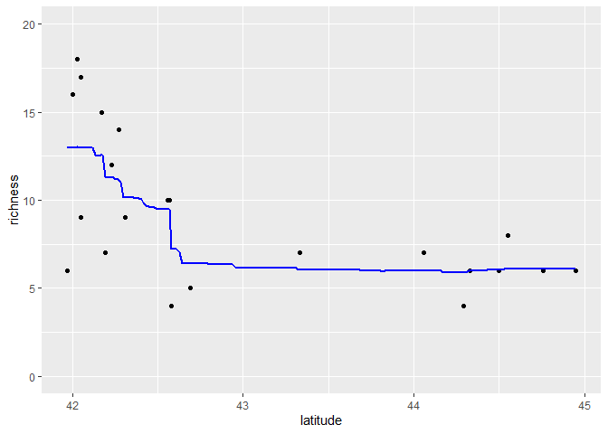

Ant data: bagging
================
Brett Melbourne
2 Feb 2022

Bagging illustrated with the ants data. We also introduce parallel
processing.

``` r
library(ggplot2)
library(dplyr)
library(tree)
library(doFuture) #For parallel processing
library(doRNG) #For safe random numbers in parallel processing
source("source/random_folds.R") #Function is now in our custom library
registerDoFuture()
```

Forest ant data:

``` r
forest_ants <- read.csv("data/ants.csv") %>% 
    filter(habitat=="forest") %>% 
    select(latitude, richness)
```

First fit a standard decision tree model for comparison. We looked at
this previously in `ants_tree.R`. We’ll visualize the prediction on a
grid that spans the latitudes.

``` r
fit <- tree(richness ~ latitude, data=forest_ants)
grid_data <- data.frame(latitude=seq(min(forest_ants$latitude), 
                                     max(forest_ants$latitude), 
                                     length.out=201))
preds1tree <- cbind(grid_data, richness=predict(fit, newdata=grid_data))
forest_ants %>%
    ggplot(aes(x=latitude, y=richness)) +
    geom_point() +
    geom_line(data=preds1tree) +
    coord_cartesian(ylim=c(0,20))
```

<!-- -->

The plot above shows that a regression tree can be a rather crude model
and in general predictive performance is not as good as other
approaches. One way to potentially improve the predictive performance of
any base model is bootstrap aggregation, aka **bagging**, an ensemble
prediction method.

The bagging algorithm:

    for many repetitions
        resample the data with replacement
        train the base model
        record prediction
    final prediction = mean of predictions

Code this algorithm in R with the above decision tree as the base
model/training algorithm. We’ll predict for the grid of latitudes in
`grid_data` that we made above.

``` r
# Bagging algorithm
boot_reps <- 500
n <- nrow(forest_ants)
nn <- nrow(grid_data)
boot_preds <- matrix(rep(NA, nn*boot_reps), nrow=nn, ncol=boot_reps)
for ( i in 1:boot_reps ) {
#   resample the data (rows) with replacement
    boot_indices <- sample(1:n, n, replace=TRUE)
    boot_data <- forest_ants[boot_indices,]
#   train the base model
    boot_fit <- tree(richness ~ latitude, data=boot_data)
#   record prediction
    boot_preds[,i] <- predict(boot_fit, newdata=grid_data)
}
bagged_preds <- rowMeans(boot_preds)
```

Plot in comparison to the single tree predictions

``` r
preds <- cbind(grid_data, richness=bagged_preds)
forest_ants %>% 
    ggplot(aes(x=latitude, y=richness)) +
    geom_point() +
    geom_line(data=preds1tree) +
    geom_line(data=preds, col="blue", size=1) +
    coord_cartesian(ylim=c(0,20)) +
    labs(title="Bagged regression tree (blue) vs single regression tree (black)")
```

<!-- -->

We see that the predictions from the bagged regression tree model are
smoother than for the single tree. To assess the predictive performance
of the bagged model against the single tree, we’ll package the bagging
algorithm in a function and then apply k-fold cross validation.

``` r
# Bagged regression tree function
# formula:    model formula (formula)
# data:       y and x data (data.frame, mixed)
# xnew_data:  x data to predict from (data.frame, mixed)
# boot_reps:  number of bootstrap replications (scalar, integer)
# return:     bagged predictions (vector, numeric)
# 
bagrt <- function(formula, data, xnew_data, boot_reps=500) {
    n <- nrow(data)
    nn <- nrow(xnew_data)
    boot_preds <- matrix(rep(NA, nn*boot_reps), nrow=nn, ncol=boot_reps)
    for ( i in 1:boot_reps ) {
    #   resample the data (rows) with replacement
        boot_indices <- sample(1:n, n, replace=TRUE)
        boot_data <- data[boot_indices,]
    #   train the base model
        boot_fit <- tree(formula, data=boot_data)
    #   record prediction
        boot_preds[,i] <- predict(boot_fit, newdata=xnew_data)
    }
    bagged_preds <- rowMeans(boot_preds)
    return(bagged_preds)
}
```

Test the function as for the previous run above (the output should be
the same, which it is, except for small Monte Carlo error)

``` r
bag_pred <- bagrt(richness ~ latitude, data=forest_ants, xnew_data=grid_data)
preds <- cbind(grid_data, richness=bag_pred)
forest_ants %>% 
    ggplot(aes(x=latitude, y=richness)) +
    geom_point() +
    geom_line(data=preds, col="blue", size=1) +
    coord_cartesian(ylim=c(0,20))
```

<!-- -->

Now we can check it’s predictive accuracy by k-fold CV. We’ll use our
functions from previous scripts. But first, a little software
engineering. It has become clear that we are repeatedly using our
`random_folds()` function and haven’t needed to change it. So, we could
make that the beginning of a collection of regularly used functions and
`source()` it instead. I added a `source` directory to the project and
put the function in a file there called `random_folds.R`. We can read
the function in using the `source()` function, which I added at the top
of this script. We can also make our CV function more general by making
two changes 1) put `data` as an argument so we have less code to alter
as we change data sets and there are no longer any global variables, and
2) replace the `dplyr::filter()` function with the base function
`subset()` to limit dependencies. Eventually we’ll work to generalize
this function to accept any model but for now we’ll continue editing it
in place.

``` r
# Function to perform k-fold CV for bagged regression tree model on ants data
# data:    y and x data (data.frame, mixed)
# k:       number of folds (scalar, integer)
# monitor: TRUE provides monitoring (logical)
# return:  CV error as MSE (scalar, numeric)
#
cv_ants <- function(data, k, monitor=FALSE) {
    fold <- random_folds(nrow(data), k)
    e <- rep(NA, k)
    for ( i in 1:k ) {
        test_data <- subset(data, fold == i)
        train_data <- subset(data, fold != i)
        pred_richness <- bagrt(richness ~ latitude, 
                               data=train_data, 
                               xnew_data=test_data)
        e[i] <- mean((test_data$richness - pred_richness) ^ 2)
        if (monitor) print(i)
    }
    cv_error <- mean(e)
    return(cv_error)
}
```

Test the function (integer sequence is monitoring progress)

``` r
cv_ants(data=forest_ants, k=5, monitor=TRUE)
```

    ## [1] 1
    ## [1] 2
    ## [1] 3
    ## [1] 4
    ## [1] 5

    ## [1] 11.52085

``` r
cv_ants(data=forest_ants, k=nrow(forest_ants), monitor=TRUE) #LOOCV
```

    ## [1] 1
    ## [1] 2
    ## [1] 3
    ## [1] 4
    ## [1] 5
    ## [1] 6
    ## [1] 7
    ## [1] 8
    ## [1] 9
    ## [1] 10
    ## [1] 11
    ## [1] 12
    ## [1] 13
    ## [1] 14
    ## [1] 15
    ## [1] 16
    ## [1] 17
    ## [1] 18
    ## [1] 19
    ## [1] 20
    ## [1] 21
    ## [1] 22

    ## [1] 13.28591

Running the above two lines of code multiple times we find that LOOCV is
quite slow but is not too variable (the variance is from stochasticity
in the bagging step of the model). As usual, there is lots of
variability in the prediction error estimate for 5-fold CV due to the
randomness of the folds. As before, we’ll need repeated folds for a more
stable estimate. However, this is starting to get computationally
intensive because we now have three resampling approaches stacked on top
of each other (bagging, CV, and replicate random folds). This is a good
time to introduce parallel processing.

In previous scripts for the ants data we used the following code with a
`for` loop to iterate through a large number of replicate random folds.
Don’t run this code: it will take a long time!

``` r
reps <- 500
cv_error <- rep(NA, reps)
for ( i in 1:reps ) {
    cv_error[i] <- cv_ants(data=forest_ants, k=5)
}
```

The above code runs in serial: iterations of the `for` loop run one
after the other. Our new `cv_ants()` function with the `bagrt()`
model/train algorithm takes a noticeable time to run, which we can
measure with `system.time`:

``` r
ts <- system.time(cv_ants(data=forest_ants, k=5))
ts
```

    ##    user  system elapsed 
    ##    3.75    0.00    3.75

So one run of 5-fold CV with `cv_ants` takes about 3-4 seconds on my
laptop. Thus, 500 reps using the `for` loop above would take about half
an hour:

``` r
500 * ts[3] / 60 #minutes
```

    ## elapsed 
    ##   31.25

We can speed this up using parallel computing. To use parallel `for`
loops, we’ll use the `doFuture` package, already loaded at the beginning
of this script. To prepare for a parallel run, we first set a “plan” for
the parallel workflow, which I’m here indicating should have 8 workers,
matching the 8 processor cores I have available on my laptop. This will
set up 8 separate R environments to run in parallel. You can omit the
`workers` argument, which will default to the number of available cores
on your computer.

``` r
plan(multisession, workers=8)
```

We can then rewrite our `for` loop using the `foreach` function as a
drop-in replacement. This says “for each element in 1:reps do cv\_ants”
and the `%dorng%` operator ensures that random number generation is done
properly and is reproducible in parallel (this is done by the `doRNG`
package, loaded at the beginning of this script). I set reps to 504
because it’s divisible by 8, the number of workers (this is the most
efficient use of the cores but is not necessary).

``` r
set.seed(4470)
reps <- 504
cv_error <- foreach ( 1:reps ) %dorng% {
    cv_ants(data=forest_ants, k=5)
}
```

Use these lines to save or load the results from long jobs:

``` r
# save(cv_error, file="04_4_ants_bag_files/saved/cv_error.Rdata")
load("04_4_ants_bag_files/saved/cv_error.Rdata")
```

That completed in 8 minutes, about a 3.5X speedup. A rough rule of thumb
is that you can expect a maximum speedup of somewhat less than NX, where
N is the number of hardware cores on your computer. My laptop has 4
hardware cores with two virtual cores per hardware core to give a total
of 8 virtual cores. To find out how many cores your computer has:

``` r
availableCores()
```

    ## system 
    ##      8

``` r
availableCores(logical=FALSE) #hardware cores only
```

    ## system 
    ##      4

The way that cores are orchestrated on a particular computer is
determined by the precise combination of hardware and operating system.
Experiment with different numbers of cores to find the best setting. The
virtual cores share resources on the hardware so it’s ultimately the
hardware that matters. To make full use of the hardware you might need
to use all the virtual cores. I found faster completion times up to 8
cores but then completion times slowed down again beyond that (since
virtual cores beyond the capacity of the hardware compete with each
other for hardware resources). On some systems, maximum performance is
achieved when the number of workers matches the number of hardware
cores, and for some algorithms when the number of workers exceeds the
number of virtual cores. Further information on the `future`
implementation of parallel processing is available in [Bengtsson
2021](https://journal.r-project.org/archive/2021/RJ-2021-048/index.html).
See also the package vignettes for `doFuture` and `doRNG`.

Our parallel run using `foreach() %dorng%` returned a list, with the
result of each iteration in each list element.

``` r
class(cv_error)
```

    ## [1] "list"

``` r
head(cv_error)
```

    ## [[1]]
    ## [1] 12.75349
    ## 
    ## [[2]]
    ## [1] 13.2159
    ## 
    ## [[3]]
    ## [1] 12.86563
    ## 
    ## [[4]]
    ## [1] 13.90105
    ## 
    ## [[5]]
    ## [1] 12.8453
    ## 
    ## [[6]]
    ## [1] 11.44715

We can convert this to a vector with `unlist()` or to a data.frame with
`dplyr::bind_row()`, or use the `.combine` argument of `foreach` ahead
of time.

``` r
cv_error <- unlist(cv_error)
```

A histogram suggests the CV replicates are a bit skewed but more or less
well behaved

``` r
hist(cv_error)
```

<!-- -->

Estimated prediction error and its Monte Carlo error (about +/- 0.07)

``` r
mean(cv_error)
```

    ## [1] 12.92919

``` r
sd(cv_error) / sqrt(length(cv_error))
```

    ## [1] 0.06941036

The corresponding estimate of prediction error from LOOCV was 13.23 +/-
0.01.

There is one tuning parameter in the bag algorithm: boot\_reps; the
number of bootstrap replications. Increasing boot\_reps will decrease
the prediction variance and usually the out-of-sample prediction error;
the more bootstrap replications the better. However, there are
diminishing returns and the computational cost increases. Because of the
bootstrap samples, the `bagrt()` algorithm is stochastic: the final
prediction will be different each time we run `bagrt()` (unless we set a
seed). This stochasticity causes prediction variance, which is defined
as the variance in the bagged prediction over repeated runs of the
algorithm on the same data. The prediction variance contributes to the
prediction error, so reducing it, as bagging does, is a good thing.

The following experiment of 20 runs on the same data of the `bagrt()`
algorithm for different values of boot\_reps shows how the prediction
variance is reduced with increasing boot\_reps. The experiment is set up
to run in parallel (about 25 secs).

``` r
runs <- 20
boot_reps <- rep(c(1, 10, 50, 100, 500, 1000), each=runs)
id <- rep(1:runs, length(boot_reps)) #unique labels for each run
preds <- foreach ( b=boot_reps, id=id ) %dorng% {
    bag_pred <- bagrt(richness ~ latitude, 
                      data=forest_ants, 
                      xnew_data=grid_data,
                      boot_reps=b)
    cbind(grid_data, richness=bag_pred, boot_reps=b, id=id)
}

preds %>% 
    bind_rows() %>%  #collapses the list of data frames to a single data frame
    ggplot() +
    geom_point(data=forest_ants, aes(x=latitude, y=richness)) +
    geom_line(aes(x=latitude, y=richness, col=factor(id))) +
    facet_wrap(vars(boot_reps), labeller=label_both) +
    coord_cartesian(ylim=c(0,20)) +
    labs(title="Each panel shows 20 realizations of bagrt()") +
    theme(legend.position="none")
```

<!-- -->

We see clearly that as the number of bootstrap replications is
increased, the variance of the prediction goes down. With 1000 bootstrap
replications the 20 realizations are almost all the same, and 500
bootstrap replications is nearly as good as 1000 at reducing the
variance.

The out-of-sample prediction error similarly goes down. This experiment
will take a long time to run. I ran it on a dedicated compute server
with 22 fast cores where it took 35 minutes. We’ll load the saved output
for analysis and plotting.

``` r
# Version of cv_ants with a boot_reps argument
cv_ants_br <- function(data, k, boot_reps) {
    fold <- random_folds(nrow(data), k)
    e <- rep(NA, k)
    for ( i in 1:k ) {
        test_data <- subset(data, fold == i)
        train_data <- subset(data, fold != i)
        pred_richness <- bagrt(richness ~ latitude, 
                               data=train_data, 
                               xnew_data=test_data,
                               boot_reps=boot_reps)
        e[i] <- mean((test_data$richness - pred_richness) ^ 2)
    }
    cv_error <- mean(e)
    return(cv_error)
}

# Experiment (run parallel)
set.seed(4106)
reps <- 506 #number of CV splits (expected precision +/- 0.07)
boot_reps <- rep(c(5, seq(10, 90, 10), seq(100, 1000, 100)), each=reps)
boot_reps <- sample(boot_reps) #shuffled for parallel efficiency
cv_error_br <- foreach ( b=boot_reps ) %dorng% {
    cv_ants_br(data=forest_ants, k=5, boot_reps=b)
}
```

Save or load the job

``` r
# save(cv_error_br, boot_reps, file="04_4_ants_bag_files/saved/br_experiment.Rdata")
load("04_4_ants_bag_files/saved/br_experiment.Rdata")
```

Calculate and plot the mean CV error as a function of boot\_reps

``` r
data.frame(cv_error=unlist(cv_error_br), boot_reps) %>% 
    group_by(boot_reps) %>% 
    summarize(mn_cv_error=mean(cv_error), 
              sd_cv_error=sd(cv_error), 
              n=n()) %>% 
    mutate(mc_error = sd_cv_error / sqrt(n)) %>% 
    ggplot(aes(x=boot_reps, y=mn_cv_error)) +
    geom_linerange(aes(ymin=mn_cv_error - mc_error, 
                       ymax=mn_cv_error + mc_error)) +
    geom_point() +
    geom_smooth(se=FALSE) +
    scale_x_continuous(breaks=seq(0, 1000, 200), 
                       minor_breaks=seq(0, 1000, 100)) +
    coord_cartesian(xlim=c(0,1000)) +
    ylab("Prediction error (MSE)")
```

    ## `geom_smooth()` using method = 'loess' and formula 'y ~ x'

<!-- -->

We see that the prediction error settles down quickly after about 200
boot\_reps. We shouldn’t pay too much attention to the lowest value at
400 as this is probably noise. The error bars are the standard error of
the mean. A setting of 500 bootstrapped trees seems a good choice. We
have now finished tuning the `boot_reps` parameter using the k-fold CV
inference algorithm. We had already set `boot_reps=500` as the default
for the `bagrt()` function, so we’ll leave it as is.

Bagging extends easily to multiple predictors of mixed type (numeric,
categorical).

``` r
# Ant data with multiple predictors

ants <- read.csv("data/ants.csv") %>% 
    select(-site) %>% 
    mutate_if(is.character, factor)

# Train a bagged tree with latitude (numeric) and habitat (categorical) as predictors
grid_data  <- expand.grid(
    latitude=seq(min(ants$latitude), max(ants$latitude), length.out=201),
    habitat=factor(c("forest","bog")))
bag_pred <- bagrt(richness ~ latitude + habitat, data=ants, xnew_data=grid_data)
preds <- cbind(grid_data, richness=bag_pred)
ants %>% 
    ggplot(aes(x=latitude, y=richness, col=habitat)) +
    geom_point() +
    geom_line(data=preds) +
    coord_cartesian(ylim=c(0,20))
```

<!-- -->

Bagging extends easily to different base models too. Here is a bagged
KNN model.

``` r
# KNN function for a vector of x_new
# x:       x data (vector, numeric)
# y:       y data (vector, numeric)
# x_new:   x values at which to predict y (vector, numeric)
# k:       number of nearest neighbors to average (scalar, integer)
# return:  predicted y at x_new (vector, numeric)
#
knn <- function(x, y, x_new, k) {
    y_pred <- NA * x_new
    for ( i in 1:length(x_new) ) {
        d <- abs(x - x_new[i])
        y_sort <- y[order(d, sample(1:length(d)))]
        y_pred[i] <- mean(y_sort[1:k])
    }
    return(y_pred)
}

# Bagged KNN function
# data:       y and x data (data.frame, mixed)
# xnew_data:  x data to predict from (data.frame, mixed)
# k:          number of nearest neighbors (scalar, integer)
# boot_reps:  number of bootstrap replications (scalar, integer)
# return:     bagged predictions (vector, numeric)
# 
bknn <- function(data, xnew_data, k, boot_reps=500) {
    n <- nrow(data)
    nn <- nrow(xnew_data)
    boot_preds <- matrix(rep(NA, nn*boot_reps), nrow=nn, ncol=boot_reps)
    for ( i in 1:boot_reps ) {
    #   resample the data (rows) with replacement
        boot_indices <- sample(1:n, n, replace=TRUE)
        boot_data <- data[boot_indices,]
    #   record prediction from base knn model
        boot_preds[,i] <- knn(x=boot_data$latitude, 
                              y=boot_data$richness, 
                              x_new=xnew_data$latitude, 
                              k)
    }
    bagged_preds <- rowMeans(boot_preds)
    return(bagged_preds)
}

# Train a bagged KNN 7 and form predictions
grid_latitude_v <- seq(min(forest_ants$latitude), max(forest_ants$latitude), length.out=201)
grid_data <- data.frame(latitude=grid_latitude_v) #dataframe for bknn, vector for knn
bknn_pred <- bknn(data=forest_ants, xnew_data=grid_data, k=7)
preds <- cbind(grid_data, richness=bknn_pred)

# Single KNN 7 fit for comparison
predsknn <- knn(forest_ants$latitude, forest_ants$richness, x_new=grid_latitude_v, k=7)
predsknn <- cbind(grid_data, richness=predsknn)

# Plot predictions
forest_ants %>% 
    ggplot(aes(x=latitude, y=richness)) +
    geom_point() +
    geom_line(data=predsknn) +
    geom_line(data=preds, col="blue", size=1) +
    coord_cartesian(ylim=c(0,20)) +
    labs(title="Bagged KNN 7 (blue) compared to single KNN 7 (black)")
```

<!-- -->

Finally, bagged decision trees are a special case of random forests
where the predictors are not randomly selected. So, in general, we can
use a random forests algorithm to do bagged regression and
classification trees. We will look at random forests next but in the
meantime here is a bagged regression tree for the ants data using the
`randomForest` package that is similar to our earlier code (presumably
the differences are due to differences in the base decision tree
algorithm). To do bagging, we set `mtry` equal to the number of
predictors. We would want to tune the `nodesize` parameter.

``` r
library(randomForest)

# Bagged tree with latitude and habitat as predictors
bag_train <- randomForest(richness ~ latitude + habitat, 
                         data=ants, ntree=500, mtry=2, nodesize=10)
grid_data  <- expand.grid(
    latitude=seq(min(ants$latitude), max(ants$latitude), length.out=201),
    habitat=factor(c("forest","bog")))
bag_pred <- predict(bag_train, newdata=grid_data)
preds <- cbind(grid_data, richness=bag_pred)
ants %>% 
    ggplot(aes(x=latitude, y=richness, col=habitat)) +
    geom_point() +
    geom_line(data=preds) +
    coord_cartesian(ylim=c(0,20))
```

<!-- -->
