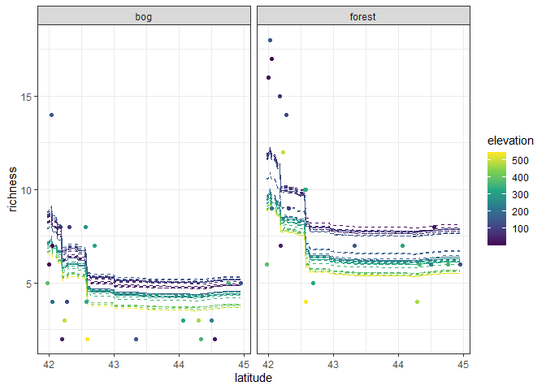

Ant data: random forest
================
Brett Melbourne
7 Feb 2022

Random forest illustrated with the ants data.

``` r
library(ggplot2)
library(dplyr)
library(tidyr)
library(tree)
library(randomForest)
#library(doFuture) #For parallel processing
#library(doRNG) #For safe random numbers in parallel processing
source("source/random_folds.R")
source("source/bagrt.R")
#registerDoFuture()
```

Ant data with 3 predictors of species richness

``` r
ants <- read.csv("data/ants.csv") %>% 
    select(richness, latitude, habitat, elevation) %>% 
    mutate(habitat=factor(habitat))
```

**Random forest** is an ensemble prediction method that extends the
bagging algorithm by randomly selecting a subset of predictor variables
at each iteration. That is, random forests combines two strategies for
enhancing generalization: resampling the data (rows) and resampling the
predictors (columns).

The random forest algorithm:

    for many repetitions
        randomly select m predictor variables
        resample the data (rows) with replacement
        train the tree model
        record prediction
    final prediction = mean of predictions

Code this algorithm in R

Since this code is a proof of concept, to keep the algorithm clear and
uncluttered by book-keeping, we’ll require that the dataset be given
with the response variable (`richness`) in the first column and the full
set of predictors in the other columns. We did that when reading in the
data above.

``` r
# Random forest algorithm

# Grid of new predictor values on which to form predictions
grid_data  <- expand.grid(
    latitude=seq(min(ants$latitude), max(ants$latitude), length.out=201),
    habitat=factor(c("forest","bog")),
    elevation=seq(min(ants$elevation), max(ants$elevation), length.out=51))

# Parameters
m <- 2 #Number of predictors to sample at each iteration
boot_reps <- 500

# Setup
n <- nrow(ants)
c <- ncol(ants)
nn <- nrow(grid_data)
boot_preds <- matrix(rep(NA, nn*boot_reps), nrow=nn, ncol=boot_reps)

# Main algorithm
for ( i in 1:boot_reps ) {
#   randomly select m predictor variables
    predictor_indices <- sample(2:c, m)
    boot_data <- ants[,c(1,predictor_indices)]
#   resample the data (rows) with replacement
    boot_indices <- sample(1:n, n, replace=TRUE)
    boot_data <- boot_data[boot_indices,]
#   train the tree model
    boot_fit <- tree(richness ~ ., data=boot_data)
#   record prediction
    boot_preds[,i] <- predict(boot_fit, newdata=grid_data)
}
rf_preds <- rowMeans(boot_preds)
```

Plot predictions with elevation mapped to the viridis color scale (this
color scale has [nice
properties](https://cran.r-project.org/web/packages/viridis/vignettes/intro-to-viridis.html)).
It’s available directly from `ggplot()` without loading an extra
package.

``` r
preds <- cbind(grid_data, richness=rf_preds)
ants %>% 
    ggplot() +
    geom_line(data=preds, 
              aes(x=latitude, y=richness, col=elevation, group=factor(elevation)),
              linetype=2) +
    geom_point(aes(x=latitude, y=richness, col=elevation)) +
    facet_wrap(vars(habitat)) +
    scale_color_viridis_c() +
    theme_bw()
```

<!-- -->

Before moving on, we’ll make the algorithm into a function. We’re not
especially concerned with performance or elegance. One small performance
boost we can easily make is reduce two copy operations to one by
extracting columns and rows at the same time. On the other hand, while
we could automatically extract the name of the response variable and
build a model formula we’ll leave it up to the user to provide a correct
formula and dataset (it’s only for our use and documented in the
function). This will also be consistent with our previous functions.

``` r
# Random forest function
# formula:    model formula to indicate response variable (formula)
#             must be: y ~ ., where y is the name of the variable
# data:       y and x data (data.frame, mixed)
#             y must be first column; all other columns will be used for x
# xnew_data:  x data to predict from (data.frame, mixed)
# m:          number of predictors to sample (scalar, integer)
# boot_reps:  number of bootstrap replications (scalar, integer)
# return:     bagged predictions (vector, numeric)
# 
random_forest <- function(formula, data, xnew_data, m, boot_reps=500) {
    # Setup
    n <- nrow(data)
    c <- ncol(data)
    nn <- nrow(xnew_data)
    boot_preds <- matrix(rep(NA, nn*boot_reps), nrow=nn, ncol=boot_reps)
    
    # Main algorithm
    for ( i in 1:boot_reps ) {
    #   randomly select m predictor variables
        predictor_indices <- sample(2:c, m)
    #   resample the data (rows) with replacement
        boot_indices <- sample(1:n, n, replace=TRUE)
    #   form the boot dataset
        boot_data <- data[boot_indices, c(1,predictor_indices)]
    #   train the tree model
        boot_fit <- tree(formula, data=boot_data)
    #   record prediction
        boot_preds[,i] <- predict(boot_fit, newdata=xnew_data)
    }
    rf_preds <- rowMeans(boot_preds)
    return(rf_preds)
}
```

Here’s how to call it. Check that it works using plotting code above to
confirm the plot is the same. The notation `~ .` means use all the
predictor variables in the data frame.

``` r
preds_rf <- random_forest(richness ~ ., data=ants, xnew_data=grid_data, m=2)
```

Train a bagged tree and a single decision tree for comparison

``` r
preds_bag <- bagrt(richness ~ ., data=ants, xnew_data=grid_data)
preds_tree <- predict(tree(richness ~ ., data=ants), newdata=grid_data)
```

Plot together

``` r
cbind(grid_data, preds_rf, preds_bag, preds_tree) %>% 
    pivot_longer(cols=starts_with("preds_"), 
                 names_to="model",
                 names_prefix="preds_",
                 values_to="richness") %>%
    ggplot() +
    geom_line(aes(x=latitude, y=richness, col=elevation, group=factor(elevation)),
              linetype=2) +
    geom_point(data=ants, aes(x=latitude, y=richness, col=elevation)) +
    facet_grid(rows=vars(model), cols=vars(habitat)) +
    scale_color_viridis_c() +
    theme_bw()
```

<!-- -->

Using `randomForest()` from the randomForest package. Compared with our
proof of concept code, the difference is due to the implementation and
default settings of the base tree algorithm.

``` r
rf_pkg_train <- randomForest(richness ~ ., data=ants, ntree=500, mtry=2)
preds_rf_pkg <- predict(rf_pkg_train, newdata=grid_data)

cbind(grid_data, preds_rf, preds_rf_pkg) %>% 
    pivot_longer(cols=starts_with("preds_"), 
                 names_to="model",
                 names_prefix="preds_",
                 values_to="richness") %>%
    ggplot() +
    geom_line(aes(x=latitude, y=richness, col=elevation, group=factor(elevation)),
              linetype=2) +
    geom_point(data=ants, aes(x=latitude, y=richness, col=elevation)) +
    facet_grid(rows=vars(model), cols=vars(habitat)) +
    scale_color_viridis_c() +
    labs(title="Top row: proof of concept code. Bottom row: randomForest package") +
    theme_bw()
```

<!-- -->

Why are about 1/3 out of bag? Because we are sampling n with
replacement. Here’s a quick simulation sampling with replacement from
n=100 rows.

``` r
reps <- 100000
n_in_bag <- rep(NA, reps)
for ( i in 1:reps ) {
    inbag <- sample(1:100, size=100, replace=TRUE)
    inbag <- unique(inbag)
    n_in_bag[i] <- sum(1:100 %in% inbag)
}
OOB <- 100 - mean(n_in_bag)
OOB #36.6% are out of bag
```

    ## [1] 36.60059

Tuning the random forest algorithm. We can use out-of-bag error for
number of trees and mtry.

``` r
# Visualize OOB error for number of trees
plot(rf_pkg_train)
```

<!-- -->

``` r
# OOB error for mtry
tuneRF(x=ants[,-1], y=ants[,1], mtryStart=3, ntreeTry=500)
```

    ## mtry = 3  OOB error = 12.31594 
    ## Searching left ...
    ## mtry = 2     OOB error = 10.96016 
    ## 0.1100837 0.05 
    ## mtry = 1     OOB error = 10.42091 
    ## 0.04920055 0.05 
    ## Searching right ...

<!-- -->

    ##   mtry OOBError
    ## 1    1 10.42091
    ## 2    2 10.96016
    ## 3    3 12.31594

For `tuneRF()` with OOB samples, it is of course stochastic and could
vary a lot from run to run on small datasets like `ants`, just as we’ve
seen such tuning stochasticity with k-fold CV. Use k-fold CV if
necessary and with repeated random splits if necessary. In general, we
want to tune number of trees, mtry, and the minimum node size of trees
(a tree stopping rule). You would proceed as in `ants_bag.R`. Variable
importance.

``` r
importance(rf_pkg_train)
```

    ##           IncNodePurity
    ## latitude       310.7906
    ## habitat        181.5550
    ## elevation      190.3374

``` r
varImpPlot(rf_pkg_train)
```

<!-- -->
