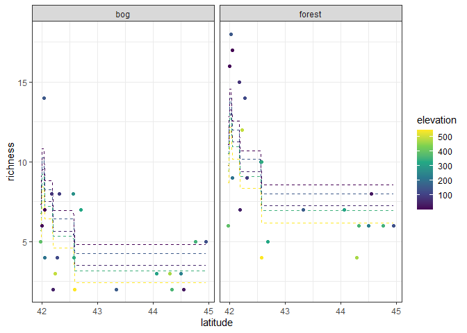
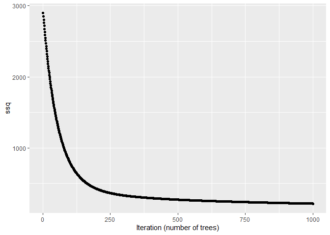
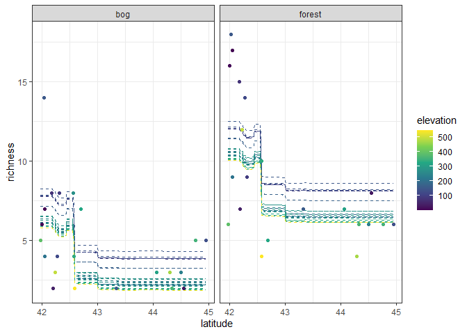

Ant data: boosted regression tree
================
Brett Melbourne
15 Feb 2022

Boosted regression tree illustrated with the ants data.

``` r
library(ggplot2)
library(dplyr)
library(tree)
library(gbm)
source("source/dtree.R")
```

Ant data with 3 predictors of species richness

``` r
ants <- read.csv("data/ants.csv") %>% 
    select(richness, latitude, habitat, elevation) %>% 
    mutate(habitat=factor(habitat))
```

**Boosting** can be viewed as an ensemble prediction method that fits
successive, potentially shrunk, models to the residuals. The final
prediction is the sum of the models (we can alternatively view it as a
weighted average of the models).

A boosted regression tree algorithm:

    load y, x, xnew
    set parameters: d, ntrees, lambda
    set f_hat(xnew) = 0
    set r = y (residuals equal to the data)
    for b in 1 to ntrees
        train d split tree model on r and x
        predict residuals, r_hat_b(x), from trained tree  
        update residuals: r = r - lambda * r_hat_b(x)
        predict y increment, f_hat_b(xnew), from trained tree
        update prediction: f_hat(xnew) = f_hat(xnew) + lambda * f_hat_b(xnew)
    return f_hat(xnew)

Code this algorithm in R

``` r
# Boosted regression tree algorithm

# load y, x, xnew
y <- ants$richness
x <- ants[,-1]
# xnew will be a grid of new predictor values on which to form predictions:
grid_data  <- expand.grid(
    latitude=seq(min(ants$latitude), max(ants$latitude), length.out=201),
    habitat=factor(c("forest","bog")),
    elevation=seq(min(ants$elevation), max(ants$elevation), length.out=51))
# or it could be set to the original x data:
# grid_data <- ants[,-1]

# Parameters
d <- 1 #Number of splits
ntrees <- 1000
lambda <- 0.01 #Shrinkage/learning rate/descent rate

# Set f_hat, r
f_hat <- rep(0, nrow(grid_data))
r <- y

ssq <- rep(NA, ntrees) #store ssq to visualize descent
for ( b in 1:ntrees ) {
#   train d split tree model on r and x
    data_b <- cbind(r, x)
    fit_b <- dtree(r ~ ., data=data_b, d=d)
#   predict residuals from trained tree
    r_hat_b <- predict(fit_b, newdata=x)
#   update residuals (gradient descent)
    r <- r - lambda * r_hat_b
    ssq[b] <- sum(r^2)
#   predict y increment from trained tree
    f_hat_b <- predict(fit_b, newdata=grid_data)
#   update prediction
    f_hat <- f_hat + lambda * f_hat_b
#   monitoring
    print(b)
}

# return f_hat
boost_preds <- f_hat
```

Plot predictions

``` r
preds <- cbind(grid_data, richness=boost_preds)
ants %>% 
    ggplot() +
    geom_line(data=preds, 
              aes(x=latitude, y=richness, col=elevation, group=factor(elevation)),
              linetype=2) +
    geom_point(aes(x=latitude, y=richness, col=elevation)) +
    facet_wrap(vars(habitat)) +
    scale_color_viridis_c() +
    theme_bw()
```

<!-- -->

Here’s how the algorithm descended the loss function (SSQ)

``` r
qplot(1:ntrees, ssq, xlab="Iteration (number of trees)")
```

<!-- -->

Boosted regression trees are implemented in the gbm package

``` r
boost_ants1 <- gbm(richness ~ ., data=ants, distribution="gaussian", 
                  n.trees=1000, interaction.depth=1, shrinkage=0.01)
boost_preds <- predict(boost_ants1, newdata=grid_data)
```

    ## Using 1000 trees...

``` r
preds <- cbind(grid_data, richness=boost_preds)
ants %>% 
    ggplot() +
    geom_line(data=preds, 
              aes(x=latitude, y=richness, col=elevation, group=factor(elevation)),
              linetype=2) +
    geom_point(aes(x=latitude, y=richness, col=elevation)) +
    facet_wrap(vars(habitat)) +
    scale_color_viridis_c() +
    theme_bw()
```

<!-- -->
