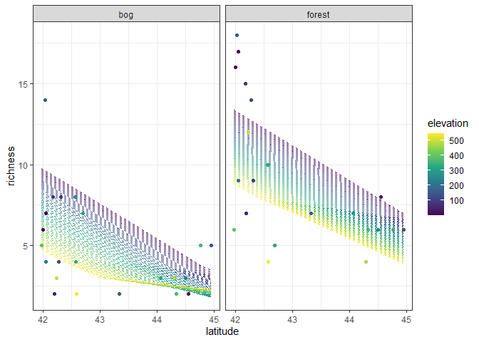
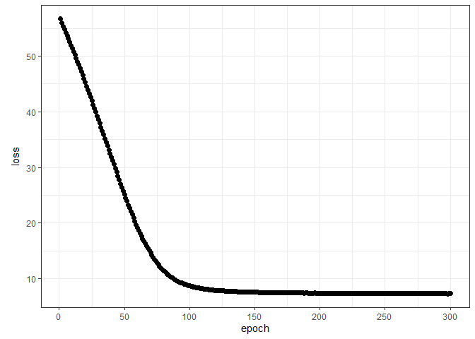
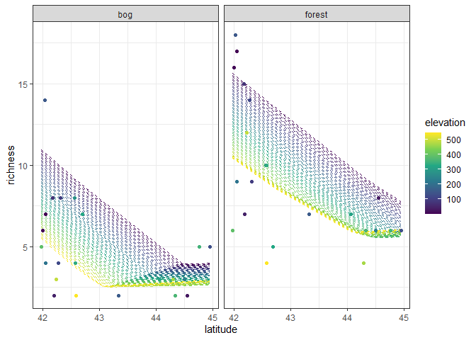

Ant data: neural network
================
Brett Melbourne
24 Feb 2022

A single layer neural network, or feedforward network, illustrated with
the ants data. We first hand code the model algorithm as a proof of
understanding. Then we code the same model and train it using Keras.

``` r
library(ggplot2)
library(dplyr)
```

Ant data with 3 predictors of species richness

``` r
ants <- read.csv("data/ants.csv") %>% 
    select(richness, latitude, habitat, elevation) %>% 
    mutate(habitat=factor(habitat))
```

### Hand-coded feedforward network

Before we go on to Keras, we’re going to hand code a feedforward network
in R to gain a good understanding of the model algorithm. Here is our
pseudocode from the lecture notes.

    Single layer neural network, model algorithm:

    define g(z)
    load X, i=1...n, j=1...p (in appropriate form)
    set K
    set weights and biases: w(1)_kj, b(1)_k, w(2)_1k, b(2)_1
    for each activation unit k in 1:K
        calculate linear predictor: z_k = b(1)_k + Xw(1)_k
        calculate nonlinear activation: A_k = g(z_k)
    calculate linear model: f(X) = b(2)_1 + Aw(2)_1
    return f(X)

Now code this algorithm in R. I already trained this model using Keras
(see later) to obtain a parameter set for the weights and biases.

``` r
# Single layer neural network, model algorithm

# define g(z)
g_relu <- function(z) {
    g_z <- ifelse(z < 0, 0, z)  
    return(g_z)
}

# load x (could be a grid of new predictor values or the original data)
grid_data  <- expand.grid(
    latitude=seq(min(ants$latitude), max(ants$latitude), length.out=201),
    habitat=factor(c("forest","bog")),
    elevation=seq(min(ants$elevation), max(ants$elevation), length.out=51))

# data preparation: scale, dummy encoding, convert to matrix
x <- grid_data %>% 
    mutate(across(where(is.numeric), scale)) %>% 
    model.matrix(~ . -1, .)

# dimensions of x
n <- nrow(x)
p <- ncol(x)

# set K
K <- 5

# set parameters
w1 <- c(-0.96660703,  0.10571498,  0.2010671, -0.86535341,
        -0.30506051, -0.09064804,  0.7194443,  0.21766625,
         0.03310419, -0.07996691,  0.2330788, -0.00206342,
        -0.55194455,  0.34334779,  1.6975850, -0.73369455,
        -0.32670146,  0.26837730, -0.7647074,  0.57788116) %>%
    matrix(nrow=5, ncol=4, byrow=TRUE)

b1 <- c(0.1678398, 0.9261078, -0.2951148, 0.6162176, -0.3971323)

w2 <- c(0.4636577, 1.590001, -0.706589, 1.67491, -0.4370111) %>% 
    matrix(nrow=1, ncol=5, byrow=TRUE)

b2 <- 1.312699

# hidden layer 1, iterating over each activation unit
A <- matrix(NA, nrow=n, ncol=K)
for ( k in 1:K ) {
#   linear predictor
    z <- x %*% t(w1[k,,drop=FALSE]) + b1[k]
#   nonlinear activation
    A[,k] <- g_relu(z)
}

# output layer 2, linear model
f_x <- A %*% t(w2) + b2

# return f(x); a redundant copy but mirrors our previous examples
nn1_preds <- f_x
```

Plot predictions

``` r
preds <- cbind(grid_data, richness=nn1_preds)
ants %>% 
    ggplot() +
    geom_line(data=preds, 
              aes(x=latitude, y=richness, col=elevation, group=factor(elevation)),
              linetype=2) +
    geom_point(aes(x=latitude, y=richness, col=elevation)) +
    facet_wrap(vars(habitat)) +
    scale_color_viridis_c() +
    theme_bw()
```

<!-- -->

### Using Keras to fit neural networks

Now we’ll consider the very same model with Keras, including training
the model on the data to determine the weight and bias parameters.

You’ll need to install Python and Tensorflow to use the `keras` package.
The `keras` package is an R interface to the Python Keras library, which
in turn is an interface to the Python Tensorflow library, which in turn
is an interface to Tensorflow (mostly C++)! See Homework 6 for
installation directions. The Python Keras library is widely used and the
R functions and workflow closely mirror the Python functions and
workflow, so what we’ll learn in Keras for R largely applies to Keras
for Python as well.

``` r
library(keras)
```

First we’ll set a random seed for reproducibility. The seed applies to
R, Python, and Tensorflow. It will take a few moments for Tensorflow to
get set up and there may be some warnings (CUDA/GPU, seed) but these
warnings are safe to ignore.

``` r
tensorflow::set_random_seed(5574)
```

    ## Loaded Tensorflow version 2.5.0

Next, prepare the data (exactly as we did for the hand-coded version):

``` r
xtrain <- ants[,-1] %>% 
    mutate(across(where(is.numeric), scale)) %>% 
    model.matrix(~ . -1, .)

ytrain <- ants[,1]
```

Next, specify the model. The basic syntax builds the model layer by
layer, using the pipe operator to express the flow of information from
the output of one layer to the input of the next. Here,
`keras_model_sequential()` says we will build a sequential (or
feedforward) network and the input layer will have `ncol(xtrain)` units
(i.e. there will be one input unit, or node, for each of the 4 predictor
columns in our ant data). The next layer, a hidden layer, will be a
densely-connected layer (i.e. all units from the previous layer
connected to all units of the hidden layer) with 5 units, and it will be
passed through the ReLU activation function. The output layer will be
another densely-connected layer with 1 unit and no activation applied.

``` r
modnn1 <- keras_model_sequential(input_shape = ncol(xtrain)) %>%
    layer_dense(units = 5) %>%
    layer_activation("relu") %>% 
    layer_dense(units = 1)
```

Again, there will likely be some warnings and messages but they are safe
to ignore.

We can check the configuration:

``` r
modnn1
```

    ## Model: "sequential"
    ## ________________________________________________________________________________
    ## Layer (type)                        Output Shape                    Param #     
    ## ================================================================================
    ## dense_1 (Dense)                     (None, 5)                       25          
    ## ________________________________________________________________________________
    ## activation (Activation)             (None, 5)                       0           
    ## ________________________________________________________________________________
    ## dense (Dense)                       (None, 1)                       6           
    ## ================================================================================
    ## Total params: 31
    ## Trainable params: 31
    ## Non-trainable params: 0
    ## ________________________________________________________________________________

The model and layer names, such as “sequential\_1” and “dense\_2” are
names given to the objects created in the tensorflow workspace for this
R session. We see that layer 1 has 25 parameters as we expect (5x4
weights and 5 biases) and the output layer has 6 parameters as we expect
(5 weights and 1 bias). This model thus has a total of 31 parameters.

Next, compile the model. We are specifying that the optimizer algorithm
is RMSprop and the loss function is mean squared error. Notice that we
are not modifying the R `modnn1` object but are instead directing Keras
in Python to set up for training the model.

``` r
compile(modnn1, optimizer="rmsprop", loss="mse")
```

The RMSprop algorithm is the default in Keras and works for most models.
It implements stochastic gradient descent with various performance
enhancements. By default, the learning rate parameter has a learning
rate of 0.001 but this can be tuned (see `?optimizer_rmsprop`). Other
optimizers are available.

Now train the model, keeping a copy of the training history. Again, we
are not getting a new R fitted-model object out of this as we would in
say a call to `fit()` with an `lm` object but instead we are directing
Keras in Python to train the model. The history object is a by-product
of training, so I put it on the right-hand side of the expression to be
clear that this is a by-product and not a traditional R fitted-model
object. In one epoch, the training data are sampled in batches (one SGD
step is taken for each batch) until all of the data have been sampled,
so the number of epochs is essentially the number of complete iterations
through the training data. I chose 300 epochs because the fit improves
only slowly beyond that. Here I used a batch size of 4, which means 10%
of the data are used on each subsample to calculate the stochastic
gradient descent step. Training will take a minute or so and a plot will
chart its progress.

``` r
fit(modnn1, xtrain, ytrain, epochs = 300, batch_size=4) -> history
```

As it takes time to train these models, it’s worth saving the model and
history so they they can be reloaded later. We can also load this saved
model in Python or share with colleagues. The help for `load_model_hdf5`
says the model will be compiled on load but that doesn’t always seem to
work (e.g. new R session, knitting). Recompile if needed.

``` r
# save_model_hdf5(modnn1, "07_2_ants_neural_net_files/saved/modnn1.hdf5")
# save(history, file="07_2_ants_neural_net_files/saved/modnn1_history.Rdata")
modnn1 <- load_model_hdf5("07_2_ants_neural_net_files/saved/modnn1.hdf5")
load("07_2_ants_neural_net_files/saved/modnn1_history.Rdata")
```

We can plot the history once training is done. If you have `ggplot2`
loaded, it will create a ggplot, otherwise it will create a base plot.

``` r
plot(history, smooth=FALSE, theme_bw=TRUE)
```

<!-- -->

We want to see the training error (RMS) decline to a reasonable level.
Although the error will continue to go down, here we see it leveling out
somewhat at about RMS=7, which is an absolute error of sqrt(7) = +/- 2.6
species.

Make predictions for our grid of new predictor variables (`x`; we made
this earlier) and plot the fitted model with the data. This plot is much
the same as the one we produced earlier “by hand” but the estimated
weights and biases are different between the two model fits (they did
not come from the same random number generator seed).

``` r
npred <- predict(modnn1, x)
preds <- cbind(grid_data, richness=npred)
ants %>% 
    ggplot() +
    geom_line(data=preds, 
              aes(x=latitude, y=richness, col=elevation, group=factor(elevation)),
              linetype=2) +
    geom_point(aes(x=latitude, y=richness, col=elevation)) +
    facet_wrap(vars(habitat)) +
    scale_color_viridis_c() +
    theme_bw()
```

<!-- -->

We can get the weights and biases, returned as a list.

``` r
get_weights(modnn1)
```

    ## [[1]]
    ##            [,1]       [,2]         [,3]       [,4]       [,5]
    ## [1,] -0.6377040 -0.2662314  0.184275016  0.7558707 -1.4819590
    ## [2,]  0.6887025  0.6319248 -0.474200338 -0.3660106 -0.2781804
    ## [3,]  1.4209439  0.1932602  1.206917167 -0.2095129  1.4634361
    ## [4,]  0.2208918 -1.0027654  0.008211858  0.4110802 -0.6978267
    ## 
    ## [[2]]
    ## [1] 0.6637277 0.8038741 0.6747898 0.1359072 0.7716070
    ## 
    ## [[3]]
    ##           [,1]
    ## [1,] 0.8153974
    ## [2,] 0.8967428
    ## [3,] 1.4523522
    ## [4,] 0.5565227
    ## [5,] 1.2700472
    ## 
    ## [[4]]
    ## [1] 0.6623505
