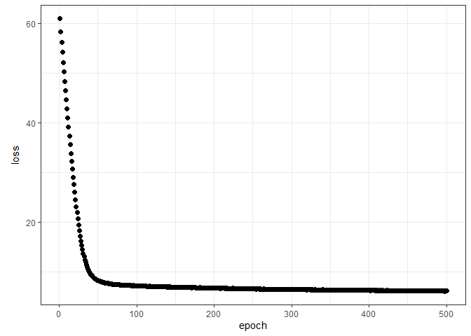
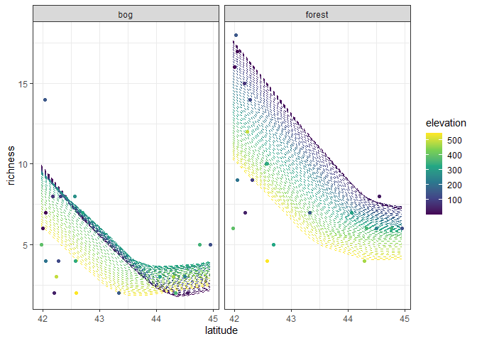
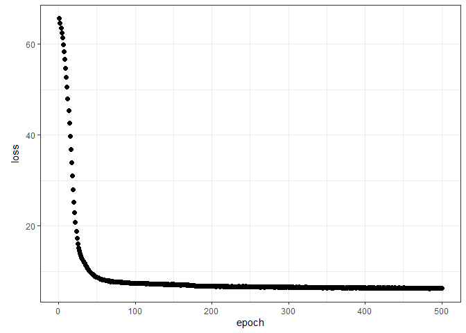

Ant data: neural network architectures
================
Brett Melbourne
28 Feb 2022

Different neural network architectures illustrated with the ants data
using Keras. We compare a wide to a deep architecture.

``` r
library(ggplot2)
library(dplyr)
library(keras)
```

Ant data with 3 predictors of species richness

``` r
ants <- read.csv("data/ants.csv") %>% 
    select(richness, latitude, habitat, elevation) %>% 
    mutate(habitat=factor(habitat))
```

Prepare the data and a set of new x to predict

``` r
xtrain <- ants[,-1] %>% 
    mutate(across(where(is.numeric), scale)) %>% 
    model.matrix(~ . -1, .)

ytrain <- ants[,1]

grid_data  <- expand.grid(
    latitude=seq(min(ants$latitude), max(ants$latitude), length.out=201),
    habitat=factor(c("forest","bog")),
    elevation=seq(min(ants$elevation), max(ants$elevation), length.out=51))

x <- grid_data %>% 
    mutate(across(where(is.numeric), scale)) %>% 
    model.matrix(~ . -1, .)
```

A wide model with 25 units

``` r
tensorflow::set_random_seed(6590)
```

    ## Loaded Tensorflow version 2.5.0

``` r
modnn2 <- keras_model_sequential(input_shape = ncol(xtrain)) %>%
    layer_dense(units = 25) %>%
    layer_activation("relu") %>% 
    layer_dense(units = 1)
modnn2
```

    ## Model: "sequential"
    ## ________________________________________________________________________________
    ## Layer (type)                        Output Shape                    Param #     
    ## ================================================================================
    ## dense_1 (Dense)                     (None, 25)                      125         
    ## ________________________________________________________________________________
    ## activation (Activation)             (None, 25)                      0           
    ## ________________________________________________________________________________
    ## dense (Dense)                       (None, 1)                       26          
    ## ================================================================================
    ## Total params: 151
    ## Trainable params: 151
    ## Non-trainable params: 0
    ## ________________________________________________________________________________

``` r
compile(modnn2, optimizer="rmsprop", loss="mse")
fit(modnn2, xtrain, ytrain, epochs = 500, batch_size=4) -> history
```

``` r
# save_model_hdf5(modnn2, "08_2_ants_nnet_architecture_files/saved/modnn2.hdf5")
# save(history, file="08_2_ants_nnet_architecture_files/saved/modnn2_history.Rdata")
modnn2 <- load_model_hdf5("08_2_ants_nnet_architecture_files/saved/modnn2.hdf5")
load("08_2_ants_nnet_architecture_files/saved/modnn2_history.Rdata")
```

``` r
plot(history, smooth=FALSE, theme_bw=TRUE)
```

<!-- -->

``` r
npred <- predict(modnn2, x)
preds <- cbind(grid_data, richness=npred)
ants %>% 
    ggplot() +
    geom_line(data=preds, 
              aes(x=latitude, y=richness, col=elevation, group=factor(elevation)),
              linetype=2) +
    geom_point(aes(x=latitude, y=richness, col=elevation)) +
    facet_wrap(vars(habitat)) +
    scale_color_viridis_c() +
    theme_bw()
```

<!-- -->

For this wide model, we get quite a flexible fit with a good deal of
nonlinearity and some complexity to the surface (e.g. the fold evident
in the bog surface).

A deep model with 25 units

``` r
tensorflow::set_random_seed(7855)
modnn3 <- keras_model_sequential(input_shape = ncol(xtrain)) %>%
    layer_dense(units = 5) %>%
    layer_activation("relu") %>%
    layer_dense(units = 5) %>%
    layer_activation("relu") %>% 
    layer_dense(units = 5) %>%
    layer_activation("relu") %>% 
    layer_dense(units = 5) %>%
    layer_activation("relu") %>% 
    layer_dense(units = 5) %>%
    layer_activation("relu") %>% 
    layer_dense(units = 1)
modnn3
```

    ## Model: "sequential_1"
    ## ________________________________________________________________________________
    ## Layer (type)                        Output Shape                    Param #     
    ## ================================================================================
    ## dense_7 (Dense)                     (None, 5)                       25          
    ## ________________________________________________________________________________
    ## activation_5 (Activation)           (None, 5)                       0           
    ## ________________________________________________________________________________
    ## dense_6 (Dense)                     (None, 5)                       30          
    ## ________________________________________________________________________________
    ## activation_4 (Activation)           (None, 5)                       0           
    ## ________________________________________________________________________________
    ## dense_5 (Dense)                     (None, 5)                       30          
    ## ________________________________________________________________________________
    ## activation_3 (Activation)           (None, 5)                       0           
    ## ________________________________________________________________________________
    ## dense_4 (Dense)                     (None, 5)                       30          
    ## ________________________________________________________________________________
    ## activation_2 (Activation)           (None, 5)                       0           
    ## ________________________________________________________________________________
    ## dense_3 (Dense)                     (None, 5)                       30          
    ## ________________________________________________________________________________
    ## activation_1 (Activation)           (None, 5)                       0           
    ## ________________________________________________________________________________
    ## dense_2 (Dense)                     (None, 1)                       6           
    ## ================================================================================
    ## Total params: 151
    ## Trainable params: 151
    ## Non-trainable params: 0
    ## ________________________________________________________________________________

``` r
compile(modnn3, optimizer="rmsprop", loss="mse")
fit(modnn3, xtrain, ytrain, epochs = 500, batch_size=4) -> history
```

``` r
# save_model_hdf5(modnn3, "08_2_ants_nnet_architecture_files/saved/modnn3.hdf5")
# save(history, file="08_2_ants_nnet_architecture_files/saved/modnn3_history.Rdata")
modnn3 <- load_model_hdf5("08_2_ants_nnet_architecture_files/saved/modnn3.hdf5")
load("08_2_ants_nnet_architecture_files/saved/modnn3_history.Rdata")
```

``` r
plot(history, smooth=FALSE, theme_bw=TRUE)
```

<!-- -->

``` r
npred <- predict(modnn3, x)
preds <- cbind(grid_data, richness=npred)
ants %>% 
    ggplot() +
    geom_line(data=preds, 
              aes(x=latitude, y=richness, col=elevation, group=factor(elevation)),
              linetype=2) +
    geom_point(aes(x=latitude, y=richness, col=elevation)) +
    facet_wrap(vars(habitat)) +
    scale_color_viridis_c() +
    theme_bw()
```

<!-- -->

The deep model has more complexity to its fit, for example more folds
and bends in the surface, for the same number of parameters and epochs.

Footnote: it would not be sensible to fit these 151 parameter models to
our small dataset of 44 without a lot of regularization and of course
tuning and k-fold cross validation, the latter of which would add so
much computation that it is not worth it. The above is for illustration
of the effect of different architectures and for comparison to the
previous machine learning approaches we have used with this dataset.
