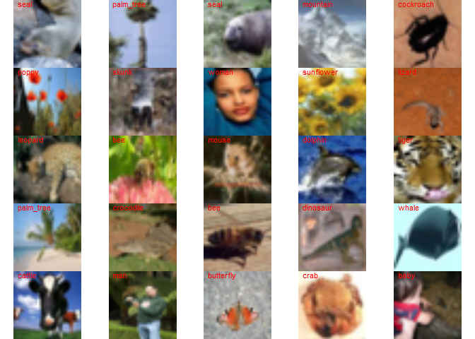

Convolutional neural network
================
Brett Melbourne
01 Mar 2022

We are using a standard benchmark dataset, CIFAR100 but subsetted to
images in ecological categories. This script has minimal commentary.

``` r
library(ggplot2)
library(dplyr)
library(keras)
tensorflow::set_random_seed(2726)
```

Read local copy of the data labels

``` r
label_names <- read.csv("data/cifar100_fine_label_names.csv")
```

Download the CIFAR100 dataset. Warning: 169 MB. Since it’s large, we’ll
store it locally in a directory for temporary data and remember to put
it in `.gitignore` so it doesn’t get uploaded to GitHub. It will take a
minute or two to download.

``` r
if ( !file.exists("data_large/cifar100.RData") ) {
    cifar100 <- dataset_cifar100()
    save(cifar100, file="data_large/cifar100.RData")
} else {
    load("data_large/cifar100.RData")
}
```

We see it’s a list with a `train` and `test` object

``` r
str(cifar100)
```

    ## List of 2
    ##  $ train:List of 2
    ##   ..$ x: int [1:50000, 1:32, 1:32, 1:3] 255 255 250 124 43 190 50 178 122 255 ...
    ##   ..$ y: num [1:50000, 1] 19 29 0 11 1 86 90 28 23 31 ...
    ##  $ test :List of 2
    ##   ..$ x: int [1:10000, 1:32, 1:32, 1:3] 199 113 61 93 80 168 37 175 233 182 ...
    ##   ..$ y: num [1:10000, 1] 49 33 72 51 71 92 15 14 23 0 ...

Subset to the ecology images (including human)

``` r
ecosubset <- subset(label_names, ecology==TRUE)
head(ecosubset, 20)
```

    ##           name label ecology
    ## 3         baby     2       1
    ## 4         bear     3       1
    ## 5       beaver     4       1
    ## 7          bee     6       1
    ## 8       beetle     7       1
    ## 12         boy    11       1
    ## 15   butterfly    14       1
    ## 16       camel    15       1
    ## 19 caterpillar    18       1
    ## 20      cattle    19       1
    ## 22  chimpanzee    21       1
    ## 25   cockroach    24       1
    ## 27        crab    26       1
    ## 28   crocodile    27       1
    ## 30    dinosaur    29       1
    ## 31     dolphin    30       1
    ## 32    elephant    31       1
    ## 33    flatfish    32       1
    ## 34      forest    33       1
    ## 35         fox    34       1

``` r
train_eco <- which(cifar100$train$y %in% ecosubset$label)    
test_eco <- which(cifar100$test$y %in% ecosubset$label)
x_train <- cifar100$train$x[train_eco,,,]
y_train <- cifar100$train$y[train_eco,, drop=FALSE]
x_test <- cifar100$test$x[test_eco,,,]
y_test <- cifar100$test$y[test_eco,, drop=FALSE]
```

What do we have?

For x we have 30500 images, each 32 x 32 pixels in 3 channels (RGB),
arranged in a 4D array. Pixel values range from 0-255.

``` r
dim(x_train)
```

    ## [1] 30500    32    32     3

``` r
class(x_train)
```

    ## [1] "array"

``` r
range(x_train)
```

    ## [1]   0 255

``` r
hist(sample(x_train, 5000))
```

<!-- -->

For y we have integers coding for 61 categories arranged in a 2D array
(1 column matrix).

``` r
dim(y_train)
```

    ## [1] 30500     1

``` r
class(y_train)
```

    ## [1] "matrix" "array"

``` r
head(y_train)
```

    ##      [,1]
    ## [1,]   19
    ## [2,]   29
    ## [3,]   11
    ## [4,]   31
    ## [5,]   96
    ## [6,]   82

``` r
sort(unique(y_train)) #61 ecological categories
```

    ##  [1]  2  3  4  6  7 11 14 15 18 19 21 24 26 27 29 30 31 32 33 34 35 36 38 42 43
    ## [26] 44 45 46 47 49 50 51 52 54 55 56 59 62 63 64 65 66 67 72 73 74 75 77 78 79
    ## [51] 80 82 88 91 92 93 95 96 97 98 99

Data preparation 1: convert image data to 0-1 scale.

``` r
x_train <- x_train / 255
x_test <- x_test / 255
```

Data preparation 2: generate new integers for the 61 ecology categories.
This must have integer category labels that range from 0 to m - 1, where
m is the number of categories. This is because tensorflow and python
array indices start at 0 (compared to R, where indices start at 1).

``` r
ecosubset$ecolabel <- 0:60
```

Here are the corresponding original and new labels (`label` vs
`ecolabel`).

``` r
head(ecosubset, 10)
```

    ##           name label ecology ecolabel
    ## 3         baby     2       1        0
    ## 4         bear     3       1        1
    ## 5       beaver     4       1        2
    ## 7          bee     6       1        3
    ## 8       beetle     7       1        4
    ## 12         boy    11       1        5
    ## 15   butterfly    14       1        6
    ## 16       camel    15       1        7
    ## 19 caterpillar    18       1        8
    ## 20      cattle    19       1        9

Now make the new integer response using the lookup table in `ecosubset`.

``` r
for ( i in 1:nrow(y_train) ) {
    y_train[i,] <- ecosubset$ecolabel[ecosubset$label==y_train[i,]]
}
for ( i in 1:nrow(y_test) ) {
    y_test[i,] <- ecosubset$ecolabel[ecosubset$label==y_test[i,]]
}
```

Check the first 10 (e.g. compare with ecosubset above)

``` r
data.frame(y_train[1:10,], name=ecosubset$name[y_train[1:10,]+1])
```

    ##    y_train.1.10...        name
    ## 1                9      cattle
    ## 2               14    dinosaur
    ## 3                5         boy
    ## 4               16    elephant
    ## 5               57 willow_tree
    ## 6               51   sunflower
    ## 7               58        wolf
    ## 8               50    squirrel
    ## 9               45       shrew
    ## 10              36   pine_tree

Data preparation 3: convert integer response to a dummy variable matrix
suitable for keras/tensorflow. We’ll use the `to_categorical()` function
from `keras` to do that.

``` r
y_train_int <- y_train #keep a copy of the integer version
y_train <- to_categorical(y_train, 61)
```

The result is a matrix with 61 columns, 1 column for each category of
organism.

``` r
class(y_train)
```

    ## [1] "matrix" "array"

``` r
dim(y_train)
```

    ## [1] 30500    61

Looking at a portion of the matrix (upper left 6x14) we see we have rows
of zeros and ones, with a 1 in the column that represents the category
of the organism in the image.

``` r
y_train[1:6,1:14] 
```

    ##      [,1] [,2] [,3] [,4] [,5] [,6] [,7] [,8] [,9] [,10] [,11] [,12] [,13] [,14]
    ## [1,]    0    0    0    0    0    0    0    0    0     1     0     0     0     0
    ## [2,]    0    0    0    0    0    0    0    0    0     0     0     0     0     0
    ## [3,]    0    0    0    0    0    1    0    0    0     0     0     0     0     0
    ## [4,]    0    0    0    0    0    0    0    0    0     0     0     0     0     0
    ## [5,]    0    0    0    0    0    0    0    0    0     0     0     0     0     0
    ## [6,]    0    0    0    0    0    0    0    0    0     0     0     0     0     0

There are 500 images in each category

``` r
colSums(y_train)
```

    ##  [1] 500 500 500 500 500 500 500 500 500 500 500 500 500 500 500 500 500 500 500
    ## [20] 500 500 500 500 500 500 500 500 500 500 500 500 500 500 500 500 500 500 500
    ## [39] 500 500 500 500 500 500 500 500 500 500 500 500 500 500 500 500 500 500 500
    ## [58] 500 500 500 500

Random selection of images

``` r
par(mar=c(0,0,0,0), mfrow=c(5,5))
for (i in sample(1:dim(x_train)[1], 25) ) {
    plot(as.raster(x_train[i,,,]))
    text(0, 30, labels=ecosubset$name[y_train_int[i,]+1], col="red", pos=4)
} 
```

<!-- -->

Each image has 3 channels: RGB

``` r
par(mar=c(0,0,0,0), mfrow=c(2,2))
plot(as.raster(x_train[200,,,]))
text(0, 30, "color", col="white", pos=4)
plot(as.raster(x_train[200,,,1]))
text(0, 30, "red channel", col="white", pos=4)
plot(as.raster(x_train[200,,,2]))
text(0, 30, "green channel", col="white", pos=4)
plot(as.raster(x_train[200,,,3]))
text(0, 30, "blue channel", col="white", pos=4)
```

<!-- -->

Define the CNN architecture (warnings as usual)

``` r
tensorflow::set_random_seed(6957)

modcnn1 <- keras_model_sequential(input_shape=c(32,32,3)) %>%
#   1st convolution-pool layer sequence
    layer_conv_2d(filters=32, kernel_size=c(3,3), padding="same") %>%
    layer_activation_relu() %>% 
    layer_max_pooling_2d(pool_size=c(2,2)) %>%
#   2nd convolution-pool layer sequence    
    layer_conv_2d(filters=64, kernel_size=c(3,3), padding="same") %>% 
    layer_activation_relu() %>% 
    layer_max_pooling_2d(pool_size=c(2,2)) %>%
#   3rd convolution-pool layer sequence    
    layer_conv_2d(filters=128, kernel_size=c(3,3), padding="same") %>% 
    layer_activation_relu() %>% 
    layer_max_pooling_2d(pool_size=c(2,2)) %>%
#   4th convolution-pool layer sequence
    layer_conv_2d(filters=256, kernel_size=c(3,3), padding="same") %>% 
    layer_activation_relu() %>% 
    layer_max_pooling_2d(pool_size=c(2,2)) %>%
#   Flatten with dropout regularization
    layer_flatten() %>%
    layer_dropout(rate=0.5) %>%
#   Standard dense layer
    layer_dense(units=512) %>%
    layer_activation_relu() %>%
#   Output layer with softmax (61 categories to predict)    
    layer_dense(units=61) %>% 
    layer_activation_softmax()
```

Check the architecture

``` r
modcnn1
```

    ## Model: "sequential"
    ## ________________________________________________________________________________
    ## Layer (type)                        Output Shape                    Param #     
    ## ================================================================================
    ## conv2d_3 (Conv2D)                   (None, 32, 32, 32)              896         
    ## ________________________________________________________________________________
    ## re_lu_4 (ReLU)                      (None, 32, 32, 32)              0           
    ## ________________________________________________________________________________
    ## max_pooling2d_3 (MaxPooling2D)      (None, 16, 16, 32)              0           
    ## ________________________________________________________________________________
    ## conv2d_2 (Conv2D)                   (None, 16, 16, 64)              18496       
    ## ________________________________________________________________________________
    ## re_lu_3 (ReLU)                      (None, 16, 16, 64)              0           
    ## ________________________________________________________________________________
    ## max_pooling2d_2 (MaxPooling2D)      (None, 8, 8, 64)                0           
    ## ________________________________________________________________________________
    ## conv2d_1 (Conv2D)                   (None, 8, 8, 128)               73856       
    ## ________________________________________________________________________________
    ## re_lu_2 (ReLU)                      (None, 8, 8, 128)               0           
    ## ________________________________________________________________________________
    ## max_pooling2d_1 (MaxPooling2D)      (None, 4, 4, 128)               0           
    ## ________________________________________________________________________________
    ## conv2d (Conv2D)                     (None, 4, 4, 256)               295168      
    ## ________________________________________________________________________________
    ## re_lu_1 (ReLU)                      (None, 4, 4, 256)               0           
    ## ________________________________________________________________________________
    ## max_pooling2d (MaxPooling2D)        (None, 2, 2, 256)               0           
    ## ________________________________________________________________________________
    ## flatten (Flatten)                   (None, 1024)                    0           
    ## ________________________________________________________________________________
    ## dropout (Dropout)                   (None, 1024)                    0           
    ## ________________________________________________________________________________
    ## dense_1 (Dense)                     (None, 512)                     524800      
    ## ________________________________________________________________________________
    ## re_lu (ReLU)                        (None, 512)                     0           
    ## ________________________________________________________________________________
    ## dense (Dense)                       (None, 61)                      31293       
    ## ________________________________________________________________________________
    ## softmax (Softmax)                   (None, 61)                      0           
    ## ================================================================================
    ## Total params: 944,509
    ## Trainable params: 944,509
    ## Non-trainable params: 0
    ## ________________________________________________________________________________

We see that the model has almost 1 million parameters! For example, in
the first convolutional layer we have 32 filters, each 3x3, for each of
the 3 input channels (RGB), so 32 x 3 x 3 x 3 = 864 weights to which we
add 32 bias parameters (one for each output channel) to give 896
parameters. In the second convolutional layer we have 64 x 3 x 3 x 32 +
64 = 18496, and so on. At the input to the dense feedforward network
where the array is flattened we have 1024 nodes connected to 512 nodes,
so 1024 x 512 weights + 512 biases = 524800 parameters. Nevertheless, we
do have a lot of data, about 94 million pixels (30500 x 32 x 32 x 3).

Compile, and fit with an 80/20 train/validate split

``` r
compile(modcnn1,
        loss="categorical_crossentropy",
        optimizer="rmsprop",
        metrics="accuracy")

fit(modcnn1, x_train, y_train,
    epochs=30,
    batch_size=128,
    validation_split=0.2) -> history
```

Save the model (or load previously trained model)

``` r
# save_model_hdf5(modcnn1, "08_3_convolutional_nnet_files/saved/modcnn1.hdf5")
# save(history, file="08_3_convolutional_nnet_files/saved/modcnn1_history.Rdata")
modcnn1 <- load_model_hdf5("08_3_convolutional_nnet_files/saved/modcnn1.hdf5")
load("08_3_convolutional_nnet_files/saved/modcnn1_history.Rdata")
```

Training history. We see evidence of overfitting after about 20 epochs
as the validation loss begins to climb again.

``` r
plot(history, smooth=FALSE)
```

<!-- -->

Plot a random selection of predictions

``` r
selection <- sort(sample(1:dim(x_test)[1], 16))
par(mar=c(0,0,0,0), mfrow=c(4,4))
for ( i in selection ) {
    pred <- as.numeric(predict(modcnn1, x_test[i,,,,drop=FALSE]))
    plot(as.raster(x_test[i,,,]))
    text(0, 30, paste("prediction =", ecosubset$name[which.max(pred)]), col="red", pos=4)
    text(0, 28, paste("prob =", round(pred[which.max(pred)],2)), col="red", pos=4)
    text(0, 26, paste("actual =", ecosubset$name[y_test[i,]+1]), col="red", pos=4)
} 
```

<!-- -->

Predictions and overall accuracy

``` r
pred_prob <- predict(modcnn1, x_test)
pred_cat <- as.numeric(k_argmax(pred_prob))
mean(pred_cat == drop(y_test))
```

    ## [1] 0.4113115

Plot probabilities for the same selection of test cases as above

``` r
pred_prob %>% 
    data.frame() %>% 
    mutate(case=seq(nrow(.))) %>%
    tidyr::pivot_longer(cols=starts_with("X"), names_to="category", values_to="probability") %>% 
    mutate(category=as.integer(sub("X", "", category)) - 1) %>% 
    filter(case %in% selection) %>% 
    ggplot() +
    geom_point(aes(x=category, y=probability)) +
    facet_wrap(vars(case), nrow=4, ncol=4, labeller=label_both)
```

<!-- -->
