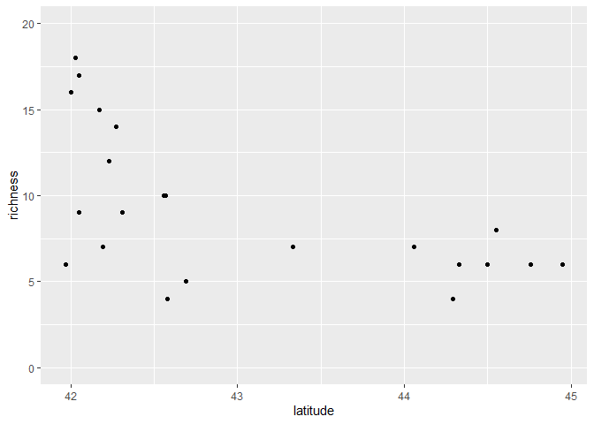
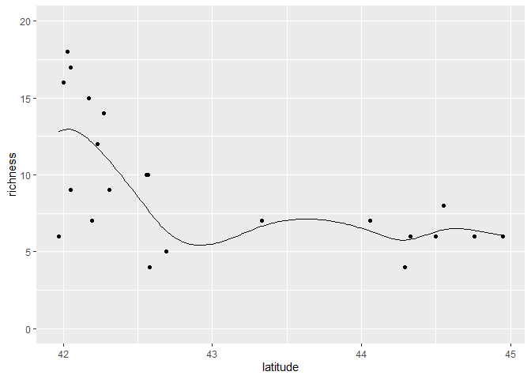
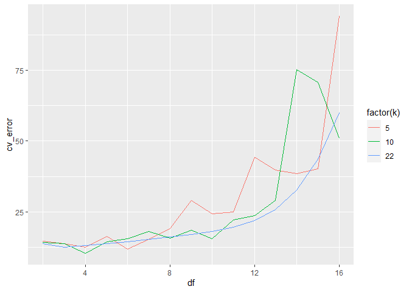
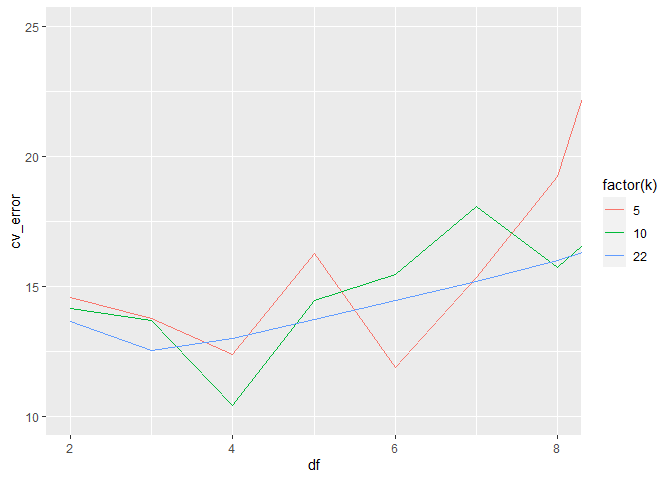
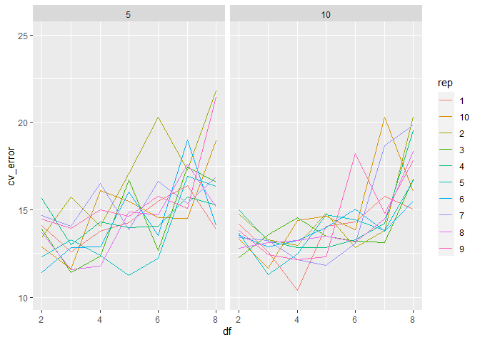
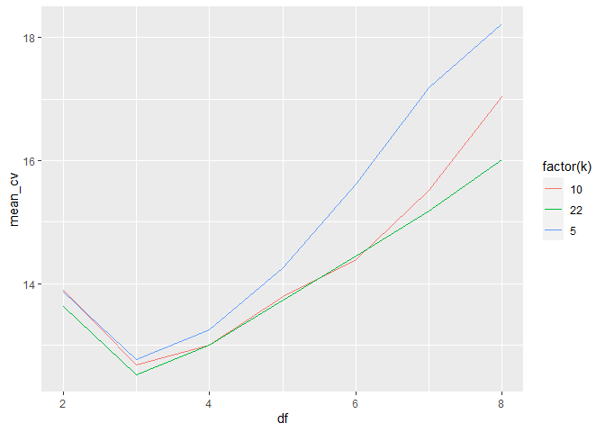

Ant data: k-fold cross validation
================
Brett Melbourne
19 Jan 2022

Investigate cross-validation with the ants data and a smoothing-spline
model

``` r
library(ggplot2)
library(dplyr)
library(tidyr)
```

Forest ant data:

``` r
forest_ants <- read.csv("data/ants.csv") %>% 
    filter(habitat=="forest")

forest_ants %>% 
    ggplot() +
    geom_point(aes(x=latitude, y=richness)) +
    coord_cartesian(ylim=c(0,20))
```

<!-- -->

Example of a smoothing spline model. Try running this next block of code
to visualize the model predictions for different values of `df`. Here is
df=7.

``` r
fit <- smooth.spline(forest_ants$latitude, forest_ants$richness, df=7)
xx  <- seq(min(forest_ants$latitude), max(forest_ants$latitude), length.out=201)
preds <- data.frame(predict(fit, xx))
forest_ants %>% 
    ggplot() +
    geom_point(aes(x=latitude, y=richness)) +
    geom_line(data=preds, aes(x=x, y=y)) +
    coord_cartesian(ylim=c(0,20))
```

<!-- -->

Using `predict` to ask for predictions from the fitted smoothing spline
model.

``` r
predict(fit, x=43.2)
```

    ## $x
    ## [1] 43.2
    ## 
    ## $y
    ## [1] 6.153927

``` r
predict(fit, x=forest_ants$latitude)
```

    ## $x
    ##  [1] 41.97 42.00 42.03 42.05 42.05 42.17 42.19 42.23 42.27 42.31 42.56 42.57
    ## [13] 42.58 42.69 43.33 44.06 44.29 44.33 44.50 44.55 44.76 44.95
    ## 
    ## $y
    ##  [1] 12.817055 12.912472 12.958514 12.947059 12.947059 12.286418 12.109456
    ##  [8] 11.736305 11.328454 10.880076  7.816294  7.688693  7.561640  6.342989
    ## [15]  6.643114  6.319358  5.750168  5.793960  6.298994  6.426903  6.377938
    ## [22]  6.057080

``` r
predict(fit, x=seq(41, 45, by=0.5))
```

    ## $x
    ## [1] 41.0 41.5 42.0 42.5 43.0 43.5 44.0 44.5 45.0
    ## 
    ## $y
    ## [1]  9.444714 11.183034 12.912472  8.577191  5.497952  7.031636  6.517861
    ## [8]  6.298994  5.967671

Implement the k-fold CV algorithm.

``` r
# Function to partition a data set into random folds for cross-validation
# n:       length of dataset (scalar, integer)
# k:       number of folds (scalar, integer)
# return:  fold labels (vector, integer)
# 
random_folds <- function(n, k) {
    min_n <- floor(n / k)
    extras <- n - k * min_n
    labels <- c(rep(1:k, each=min_n),rep(seq_len(extras)))
    folds <- sample(labels, n)
    return(folds)
}
```

What does the output of `random_folds()` look like?

``` r
random_folds(nrow(forest_ants), k=5)
```

    ##  [1] 5 3 1 3 1 5 5 2 5 3 1 4 2 4 2 3 1 2 1 2 4 4

``` r
random_folds(nrow(forest_ants), k=nrow(forest_ants)) #k=n is LOOCV
```

    ##  [1] 15 13 19 10  3 22 20 16 21  1 18  6 17  4 12  8 14  2  9  7  5 11

Now code up the k-fold CV algorithm to estimate the prediction mean
squared error for one value of df. Try 5-fold, 10-fold, and n-fold. Try
different values of df.

``` r
df <- 7
k <- 5

# divide dataset into k parts i = 1...k
forest_ants$fold <- random_folds(nrow(forest_ants), k)

# initiate vector to hold e
e <- rep(NA, k)

# for each i
for ( i in 1:k ) {
#   test dataset = part i
    test_data <- forest_ants %>% filter(fold == i)
#   training dataset = remaining data
    train_data <- forest_ants %>% filter(fold != i)
#   find f using training dataset
    trained_f <- smooth.spline(train_data$latitude, train_data$richness, df=df)
#   use f to predict for test dataset
    pred_richness <- predict(trained_f, test_data$latitude)$y
#   e_i = prediction error (mse)
    e[i] <- mean((test_data$richness - pred_richness) ^ 2)
}

# CV_error = mean(e)
cv_error <- mean(e)
cv_error
```

    ## [1] 15.30882

Encapsulate the above as a function to explore the accuracy of models
with differing df and the behavior of the CV algorithm with different
values for k.

``` r
cv_ants <- function(k, df) {
    forest_ants$fold <- random_folds(nrow(forest_ants), k)
    e <- rep(NA, k)
    for ( i in 1:k ) {
        test_data <- forest_ants %>% filter(fold == i)
        train_data <- forest_ants %>% filter(fold != i)
        trained_f <- smooth.spline(train_data$latitude, train_data$richness, df=df)
        pred_richness <- predict(trained_f, test_data$latitude)$y
        e[i] <- mean((test_data$richness - pred_richness) ^ 2)
    }
    cv_error <- mean(e)
    return(cv_error)
}
```

Test the function

``` r
cv_ants(k=5, df=7) 
```

    ## [1] 14.48623

``` r
cv_ants(k=nrow(forest_ants), df=7)
```

    ## [1] 15.18528

Explore a grid of values for df and k

``` r
grid <- expand.grid(k=c(5,10,nrow(forest_ants)), df=2:16)
grid
```

    ##     k df
    ## 1   5  2
    ## 2  10  2
    ## 3  22  2
    ## 4   5  3
    ## 5  10  3
    ## 6  22  3
    ## 7   5  4
    ## 8  10  4
    ## 9  22  4
    ## 10  5  5
    ## 11 10  5
    ## 12 22  5
    ## 13  5  6
    ## 14 10  6
    ## 15 22  6
    ## 16  5  7
    ## 17 10  7
    ## 18 22  7
    ## 19  5  8
    ## 20 10  8
    ## 21 22  8
    ## 22  5  9
    ## 23 10  9
    ## 24 22  9
    ## 25  5 10
    ## 26 10 10
    ## 27 22 10
    ## 28  5 11
    ## 29 10 11
    ## 30 22 11
    ## 31  5 12
    ## 32 10 12
    ## 33 22 12
    ## 34  5 13
    ## 35 10 13
    ## 36 22 13
    ## 37  5 14
    ## 38 10 14
    ## 39 22 14
    ## 40  5 15
    ## 41 10 15
    ## 42 22 15
    ## 43  5 16
    ## 44 10 16
    ## 45 22 16

``` r
cv_error <- rep(NA, nrow(grid))
set.seed(1280) #For reproducible results in this text
for ( i in 1:nrow(grid) ) {
    cv_error[i] <- cv_ants(grid$k[i], grid$df[i])
}
result1 <- cbind(grid,cv_error)
```

Plot the result. Make k a factor to get discrete colors.

``` r
result1 %>% 
    ggplot() +
    geom_line(aes(x=df, y=cv_error, col=factor(k)))
```

<!-- -->

We see that RMSE prediction error (cv\_error) increases dramatically for
df beyond 8 or so. We also see that cv\_error estimates are quite
variable for k=10 and especially k=5. This is due to the randomness of
partitioning a very small dataset into folds. If we repeat the above
with a different seed, we’d get different results for k=5 or k=10. LOOCV
is deterministic, so it won’t differ if we repeat it. Let’s zoom in to
the zone with the best performing values for df.

``` r
result1 %>% 
    ggplot() +
    geom_line(aes(x=df, y=cv_error, col=factor(k))) +
    coord_cartesian(xlim=c(2,8),ylim=c(10,25))
```

<!-- -->

LOOCV (k=22) identifies df=3 as the best performing model, whereas in
this particular run 10-fold CV identifies df=4 and 5-fold CV identifies
df=6. What should we do here? Given the uncertainty in RMSE estimates
for the lower values of k, we’d be best to use LOOCV as a default. But
we could also try for a better estimate by repeated k-fold runs. Let’s
explore the variability in 10-fold and 5-fold CV.

``` r
grid <- expand.grid(k=c(5,10), df=2:8)
reps <- 100
cv_error <- matrix(NA, nrow=nrow(grid), ncol=reps)
set.seed(1978) #For reproducible results in this text
for ( j in 1:reps ) {
    for ( i in 1:nrow(grid) ) {
        cv_error[i,j] <- cv_ants(grid$k[i], grid$df[i])
    }
    print(j) #monitor progress
}
result2 <- cbind(grid,cv_error)
```

Plot the first 10 reps for each k-fold

``` r
result2 %>% 
    select(1:12) %>%
    pivot_longer(cols="1":"10", names_to="rep", values_to="cv_error") %>% 
    ggplot() +
    geom_line(aes(x=df, y=cv_error, col=rep)) +
    facet_wrap(vars(k)) +
    coord_cartesian(xlim=c(2,8),ylim=c(10,25))
```

<!-- -->

We see again that there is more variability for 5-fold CV and for both
5-fold and 10-fold CV there is so much variability, we’d pick a
different value for df on each run. So, we wouldn’t want to rely on a
single k-fold run. Averaging across runs would give a better estimate of
the prediction RMSE.

``` r
result2$mean_cv <- apply(result2[,-(1:2)], 1, mean)
```

Plot shows that averaged across runs, we’d pick the same df as LOOCV
(k=22). We also see that LOOCV probably underestimates the prediction
RMSE by a little bit since k=5 is likely a better estimate of the
prediction RMSE.

``` r
loocv <- result1 %>% 
    filter(k == 22, df <= 8)

ggplot() +
    geom_line(data=result2, aes(x=df, y=mean_cv, col=factor(k))) +
    geom_line(data=loocv, aes(x=df, y=cv_error, col=factor(k)))
```

<!-- -->
